# Práctica 1. Instalación de ambiente (Spark, Python y bibliotecas)

**Objetivo de la práctica:**
Al finalizar la práctica serás capaz de:
- Configurar el servidor de PySpark en Linux y el IDE PyCharm.

**Duración aproximada:**
- 60 minutos.

**Prerequisitos:**

- Acceso al ambiente Linux (credenciales provistas en el curso) o Linux local con interfaz gráfica.
- Conexión a internet.

**Instrucciones:**

## Tarea 1: Instalar prerrequisitos

**Iniciar la conexión al ambiente virtual**

Iniciar la conexión al servidor a través de RDP de acuerdo a la información provista en el curso:

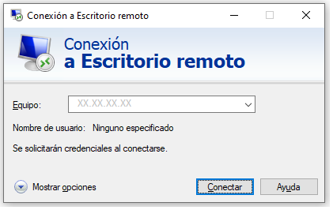

Proveer las credenciales del usuario y contraseña provistos en el curso:

## Instalación de requisitos

Abrir una ventana de terminal. Desde aquí instalaremos el JDK de Java.

> **sudo apt-get install openjdk-8-jdk**

**Verificar la instalación**

Editar el archivo .bashrc para agregar los binarios de Java a la ruta del ambiente.

> **nano ~/.bashrc**
>
> **export JAVA\_HOME=/usr/lib/jvm/java-8-openjdk-amd64/**

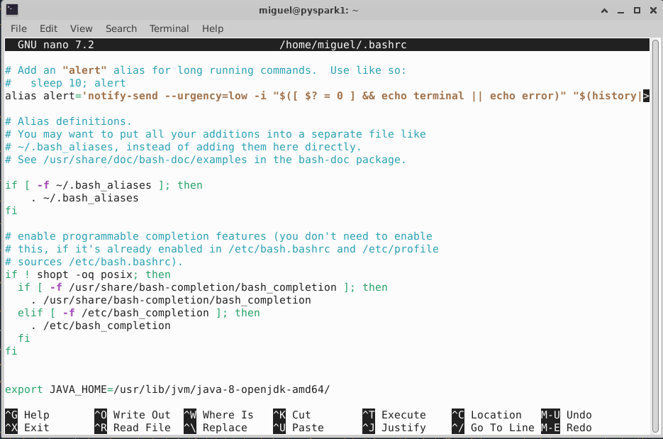

Aplicar los cambios y verificar la versión de Java.

source ~/.bashrc

java –version

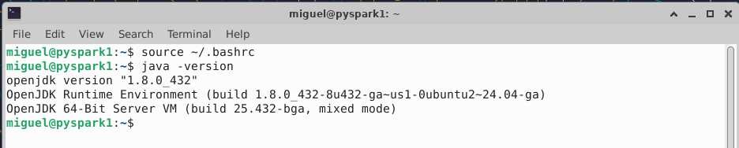

**Instalación PIP3, el manejador de paquetes de Python**

PIP es un gestor de paquetes y librerías para Python, permite gestionar dependencias de una manera muy sencilla. Primero, se actualizan los paquetes y se instala pip3:

sudo apt-get update

sudo apt-get install python3-pip

pip3 –version

Renombrar comando pip3 a pip (esto es opcional).

echo alias pip=pip3 &gt;&gt; ~/.bashrc

source ~/.bashrc

pip --version

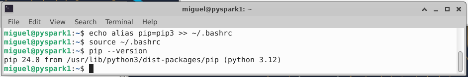

## Tarea 2: Instalación de Spark

Ya con el prerrequisito de Java, ahora se instalará el motor de Spark. Para ello, hay que descargar el paquete desde la página de Apache Spark. Se descarga el paquete de acuerdo a la versión deseada.

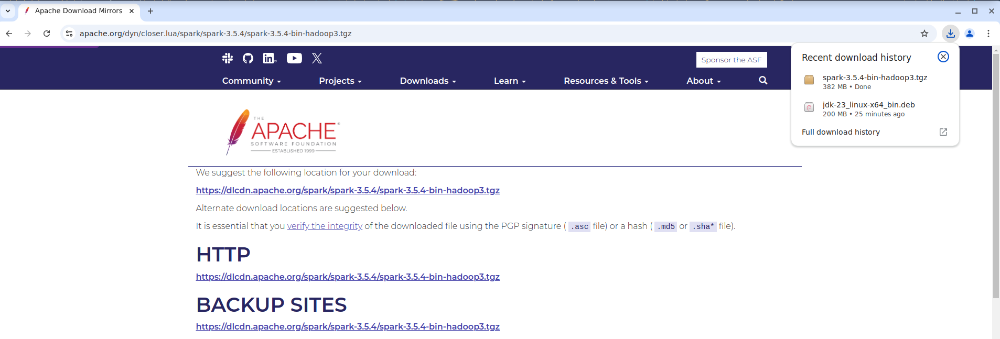

Descomprimir el paquete con el siguiente comando:

tar -xvzf

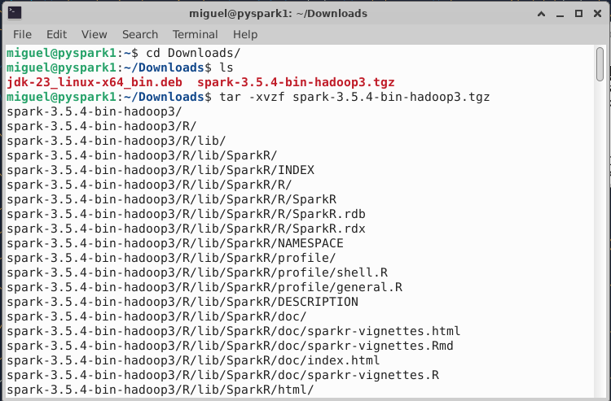

No es estrictamente necesario, pero se puede mover el directorio de Spark a una ubicación más accesible:

sudo mv spark-3.5.4-bin-hadoop3 /usr/local/spark

## 

## Tarea 3: Configuración de variables

Establecer las variables necesarias para Spark, de acuerdo al directorio donde se haya desempaquetado. Para ello, con el editor preferido, editar el archivo .bashrc.

nano ~/.bashrc

export SPARK\_HOME=/usr/local/spark

export PATH=$PATH:$SPARK\_HOME/bin

export PYTHONPATH=$SPARK\_HOME/python:$SPARK\_HOME/python/lib/py4j-0.10.9.7-src.zip:$PYTHONPATH

export PYSPARK\_PYTHON=python3

>***Importante: El nombre del archivo py4j dependerá de la versión que se tenga instalada***

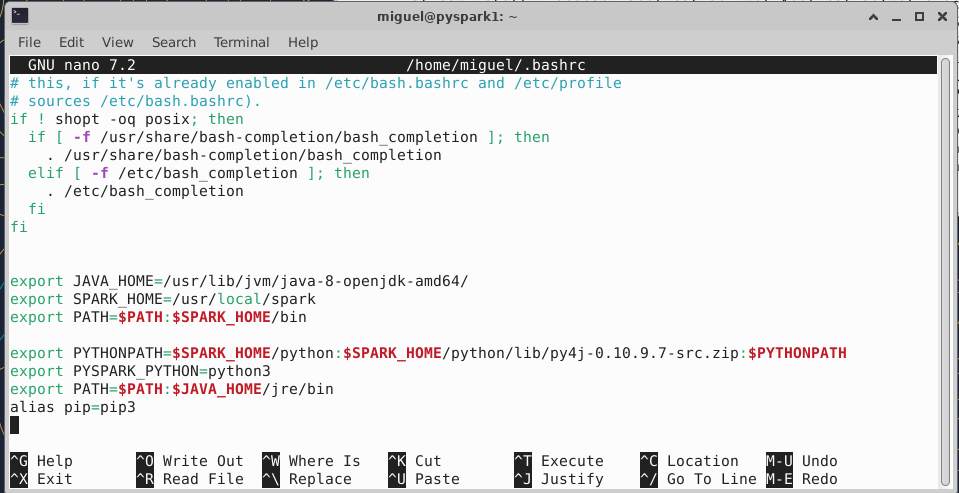

Guardar los cambios y salir del editor. 
Aplicar estos cambios con el siguiente comando:

source: ~/.bashrc

**Probar al acceso a pyspark**

Una vez instalado, hacemos la prueba desde línea a terminal:

pyspark

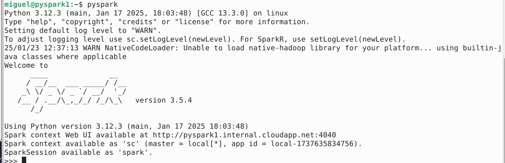

> ***Nota: En ocasiones, puede aparecer un error indicando que no puede acceder al servidor. Si esto ocurre, editar el archivo load-spark-env.sh en el directorio spark/bin y adicionar la siguiente línea:***

***export SPARK\_LOCAL\_IP="127.0.0.1"***

Nótese que se establecieron diferentes elementos por omisión:

Spark context Web UI available at http://pyspark1.internal.cloudapp.net:4040

Spark context available as 'sc' (master = local\[\*\], app id = local-1737635834756).

SparkSession available as 'spark'.

Probar la instalación con los siguientes comandos:

print(sc)

print(sc.version)

print(spark)

exit()

## Tarea 4: Instalación de PyCharm

Vamos a requerir una herramienta para trabajar con el código de PySpark. Existen varias opciones, pero **PyCharm** es una de las mejores IDEs. 
- Tiene versiones de la comunidad y empresarial.
- Cuenta con diferentes características para hacer muy productivo el desarrollo.

Actualizar Linux con los siguientes comandos:

sudo apt-get update -y

sudo apt-get upgrade -y

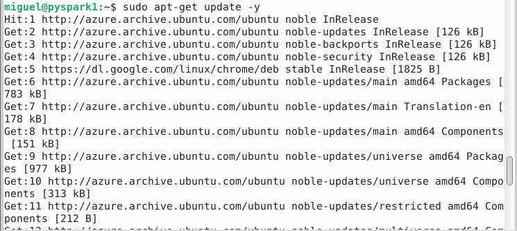

Para instalar PyCharm en el sistema, debes tener instalada la utilidad Snap. Ejecutar el comando para instalarla.

sudo apt install snapd

Hay varias formas de instalar las diferentes ediciones de PyCharm. El siguiente comando instalará la edición de la comunidad desde la línea de comandos:

sudo snap install pycharm-community --classic

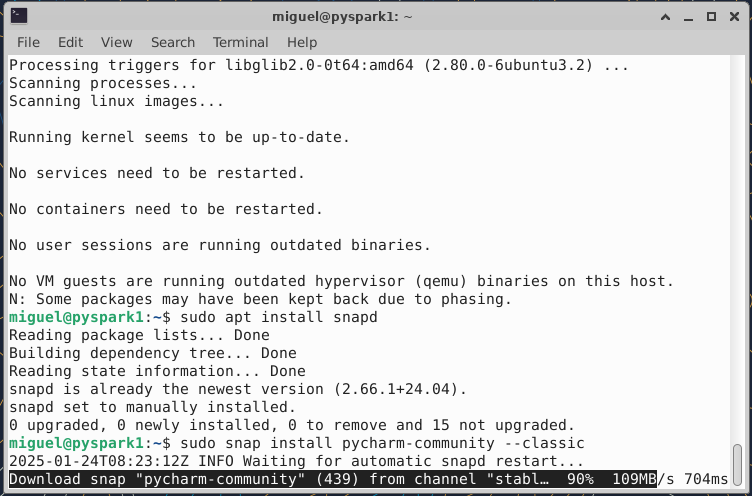

Iniciar con

pycharm-community

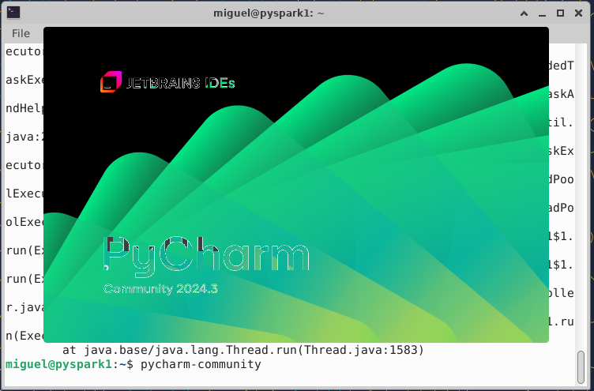

Aceptar el acuerdo de licencia. Opcionalmente podemos aceptar o negar el compartir información de sesiones.

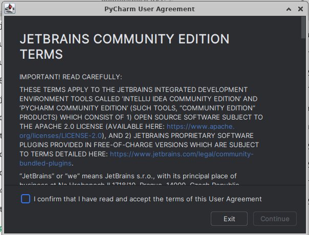

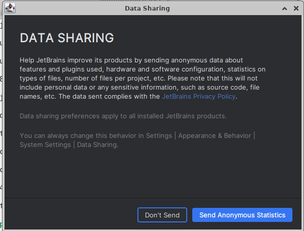

Finalmente, tenemos la pantalla de inicio.

**Fin del laboratorio**
