# Práctica 2. Creación de RDD en PySpark

## Objetivo
Al finalizar la práctica, serás capaz de:
- Iniciar la carga de datos en RDD a partir de diferentes fuentes de información.

## Duración aproximada: 
- 45 minutos

## Prerequisitos

- Acceso a ambiente Linux (credenciales provistas en el curso) o Linux local con interfaz gráfica.

- Haber completado la instalación del ambiente (laboratorio 1).

## Instrucciones

Un RDD (Resilient Distributed Dataset) es la unidad básica de datos en
Spark. Puedes conceptualizarlos como una colección inmutable de
elementos que pueden procesarse en paralelo a través de un clúster.

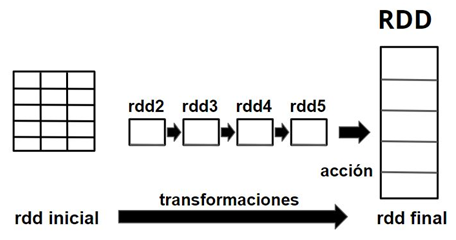 

Antes de crear un RDD, necesitas una sesión de Spark. Esta sesión es la conexión entre el programa y el motor de Spark.

SparkSession es un punto de inicio a la funcionalidad de Spark y es
necesaria para crear un contexto para operar PySpark. SparkContext
representa la conexión a un clúster de Spark.

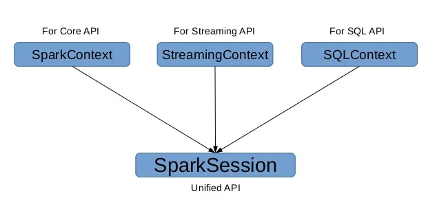

### Tarea 1. Crear y configurar SparkSession y SparkContext

Iniciamos PyCharm con el siguiente comando: `pycharm-community`.

Creamos un proyecto y editamos el archivo `.py`. 

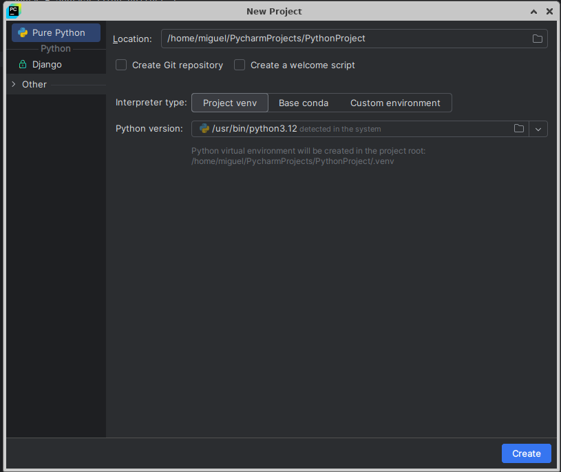

Para acceder a la sesión de Spark y tener acceso a RDD, crea
un SparkSession. Este puede tomar diferentes parámetros para tomar el
control de las características de la conexión desde Python. La manera
más simple es la siguiente.

```
spark = SparkSession.builder \\

.getOrCreate()
```

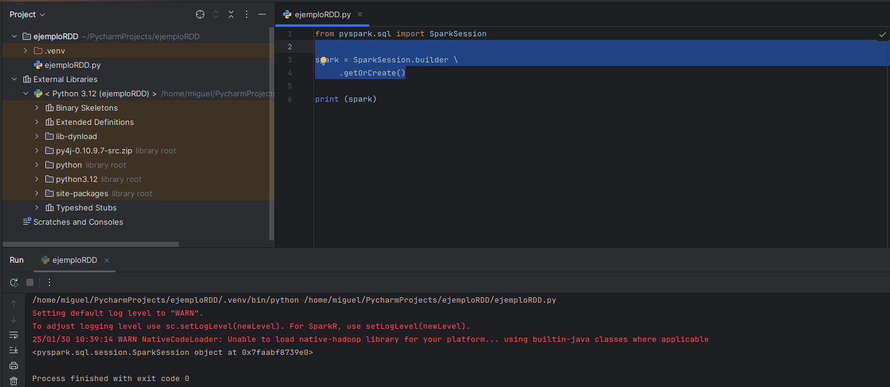


La función `SparkSession.builder.getOrCreate()` obtiene una
SparkSession existente o, si no hay ninguna, crea una nueva en función
de las opciones establecidas en este builder.

Además, existen otras funciones importantes para configurar la
sesión:

-   `SparkSession.builder.appName(name)` establece un nombre para la
    aplicación, que se mostrará en la interfaz de usuario web de Spark.

-   `SparkSession.builder.master(master)` establece la dirección URL
    maestra de Spark a la cual conectarse, como `local` para ejecutarse
    localmente, `local\[4\]` para ejecutarse localmente con 4 núcleos o
    `spark://master:7077` para ejecutarse en un clúster independiente de
    Spark.

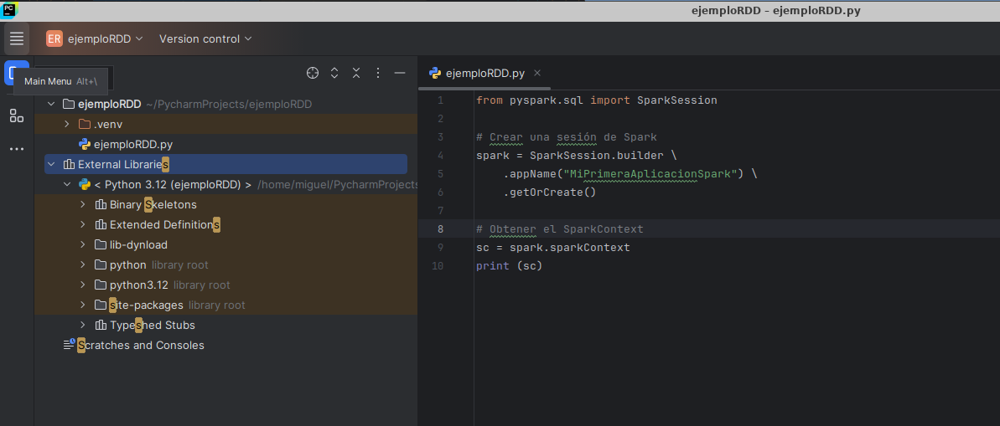

```
from pyspark.sql import SparkSession

spark = SparkSession.builder \\

.master("local") \\

.appName("MiPrimeraAplicacionSpark") \\

.getOrCreate()

print(spark)
```

- En el parámetro `master`, se puede indicar en cuántos núcleos quieres
lanzar la ejecución.

```
from pyspark.sql import SparkSession

spark = SparkSession.builder \\

.master('local\[2\]') \\

.appName("MiPrimeraAplicacionSpark") \\

.getOrCreate()
```

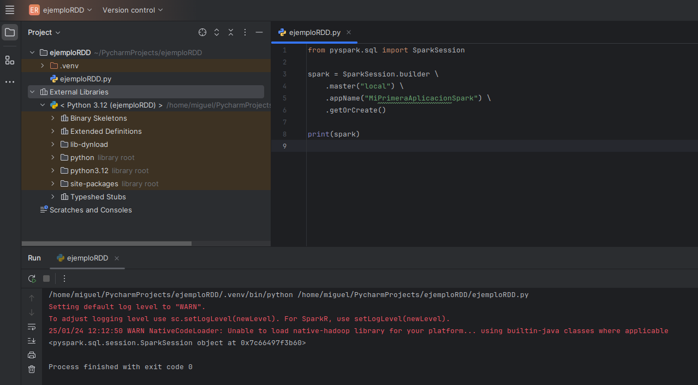

**Configuración básica del SparkContext**

Una forma de establecer características de trabajo es definir parámetros
al objeto `SparkContext`. Estas opciones pueden aplicar también a
características de configuración. Por ejemplo, el uso de memoria:

```
import pyspark.sql

spark = pyspark.sql.SparkSession.builder \\

.appName("EjemploPySpark") \\

.config("spark.memory.offHeap.enabled", "true") \\

.config("spark.memory.offHeap.size", "10g") \\

.getOrCreate()

print(spark)
```

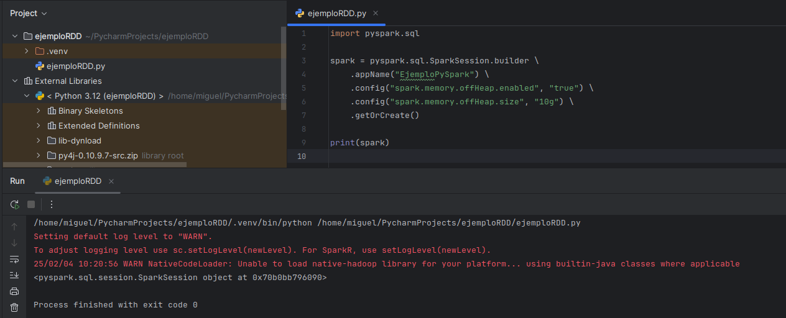

Otra forma es crear el objeto `SparkConf`. Esto principalmente por
necesidad de control a bajo nivel o por compatibilidad.
```
from pyspark import SparkContext, SparkConf

\# Configuración básica

conf = SparkConf() \\

.setAppName("MiApp")\\

.setMaster("local\[\*\]")

\# Crear el SparkContext

sc = SparkContext(conf=conf)

\# Ejemplo de operación

data = \[1, 2, 3, 4, 5\]

rdd = sc.parallelize(data)

print(rdd.collect())

\# Detener el SparkContext

sc.stop()
```


Los mismos parámetros de configuración que se utilizaron anteriormente,
se pueden aplicar al objeto `SparkConfig`:

```
from pyspark import SparkContext, SparkConf

\# Configuración avanzada

conf = SparkConf() \\

.setAppName("MiAppAvanzada") \\

.setMaster("local\[\*\]") \\

.set("spark.executor.memory", "2g") \\

.set("spark.driver.memory", "1g") \\

.set("spark.cores.max", "4")

\# Crear el SparkContext

sc = SparkContext(conf=conf)

\# Aquí vendrían instrucciones para la operación...

\# Detener el SparkContext

sc.stop()
```

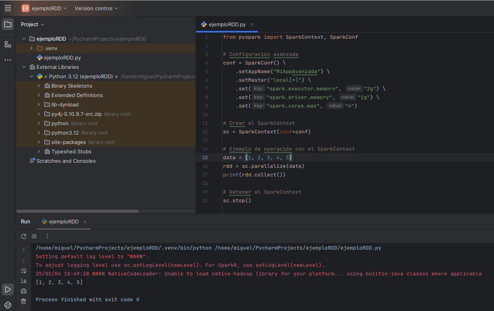

Aunque está disponible, la recomendación es no utilizar el objeto
SparkContext directamente, ya que SparkSession es una interfaz unificada
que incluye SparkContext, SQLContext y HiveContext. Lo cual simplifica
el código:


```
[from pyspark.sql import SparkSession]{.underline}

\# Crear una SparkSession

spark = SparkSession.builder \\

.appName("MiAppAvanzada") \\

.master("local\[\*\]") \\

.config("spark.executor.memory", "2g") \\

.config("spark.driver.memory", "1g") \\

.config("spark.cores.max", "4")\\

.getOrCreate()

\# Operaciones de procesamiento...

\# Detener la SparkSession

spark.stop
```

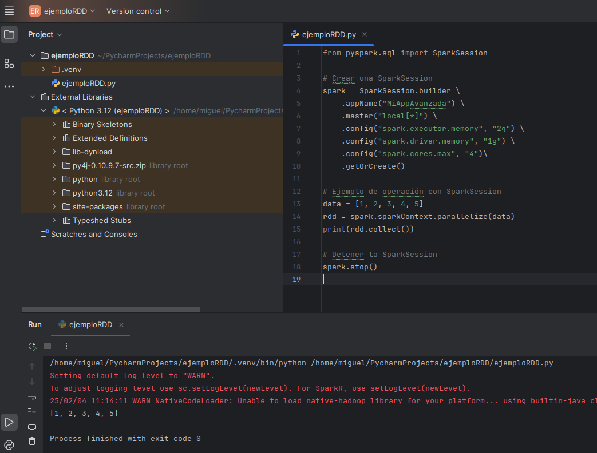

## Tarea 2. Crear un RDD a partir de conjuntos

En RDD, cada registro se procesa de forma independiente amanera de fila.
No existen las columnas. Los RDD son la estructura de datos fundamental
que representa colecciones distribuidas de objetos; además, son inmutables y tolerantes a fallos por naturaleza. Son la
forma de representar un conjunto de datos distribuido en varios nodos de
un clúster, que se puede operar en paralelo. Se denominan
resilientes porque siempre se pueden volver a calcular cuando se produce
un error en un nodo.


Se pueden crear de varias maneras.

**Ejemplo con RDD vacío**
```
from pyspark.sql import SparkSession

\# Create spark session

spark = SparkSession \\

.builder \\

.appName(\"Ejamplo RDDs vacío\") \\

.getOrCreate()

sc = spark.sparkContext

rddVacio = sc.emptyRDD

print(rddVacio)
```

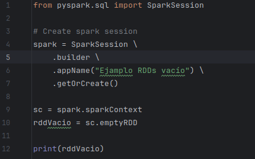

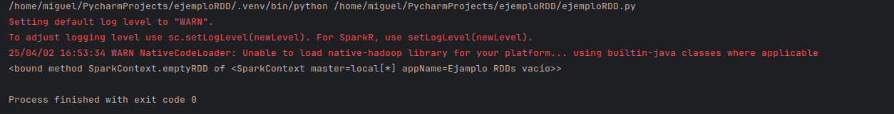

**Crear RDD con range**
```
from pyspark import SparkContext, SparkConf

\# Configuración de la sesión

conf = SparkConf() \\

.setAppName(\"Ejemplo con rango\") \\

.setMaster(\"local\[\*\]\") \\

\# Crear el SparkContext

sc = SparkContext(conf=conf)

\# Crear RDD con números del 1 al 1000

rdd_rango = sc.parallelize(range(1, 1001))

\# Contar elementos

print(rdd_rango.count()) \# Salida: 1000
```

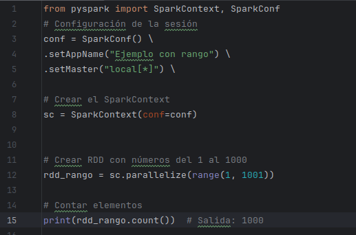

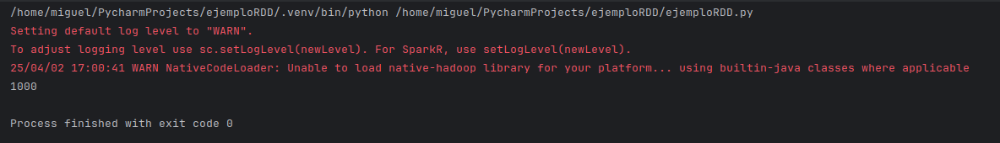

**Crear RDD desde listas**

Una forma de crear un RDD es a partir de listas.

```
from pyspark.sql import SparkSession

spark = SparkSession.builder \\

.master("local") \\

.appName("RDDdesdeLista") \\

.getOrCreate()

data = \["Laptop", "Impresora", "Teclado", "Memoria"\]

rdd = spark.sparkContext.parallelize(data)

print (data)
```

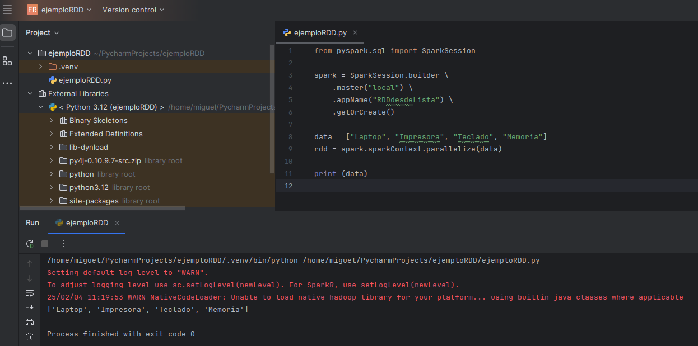

En PySpark, el método `parallelize` se usa para crear un RDD a partir
de una lista de Python. Esto permite distribuir los datos entre varios
nodos de un clúster, lo que logra el procesamiento en paralelo.

**Creando RDD desde tuplas**
```
from pyspark import SparkContext

\# Inicializar SparkContext

sc = SparkContext(\"local\", \"Ejemplo RDD\")

\# Datos en una lista de Python

datos = \[(\"Ana\", 25), (\"Berta\", 30), (\"Carolina\", 35)\]

\# Crear un RDD

rdd = sc.parallelize(datos)

\# Mostrar los datos

print(\"Contenido del RDD:\", rdd.collect())

\# Mostrar el tipo de datos

print(\"Tipo de datos:\", type(rdd))
```
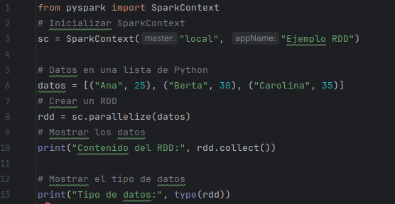

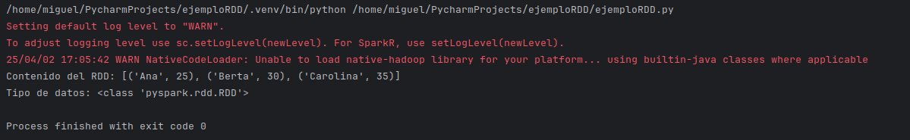

En este ejemplo:

-   `sc.parallelize(data)` convierte la lista `data` en un RDD.

-   `rdd.collect()` recupera todos los elementos del RDD y los
    devuelve como una lista.

### Tarea 3. Crear un RDD a partir de un archivo de texto

Para crear un RDD a partir de archivos en Apache Spark, se pueden usar métodos integrados para leer
datos del archivo y generar un DataSet (se explicarán más adelante).
```
from pyspark import SparkContext

\# Inicializar SparkContext

sc = SparkContext(\"local\", \"RDD desde archivo\")

\# Crear RDD desde un archivo de texto

text_rdd = sc.textFile(\"/home/miguel/data/salesrpt.txt\")

\# Mostrar el contenido

print(\"Contenido del archivo texto:\")

print(text_rdd.collect()) \# collect() trae todos los datos al driver

\# Contar líneas

print(f\"Número de líneas: {text_rdd.count()}\")

\# Mostrar primeras 5 líneas

print(\"Primeras 5 líneas:\")

for line in text_rdd.take(5):

print(line)
```

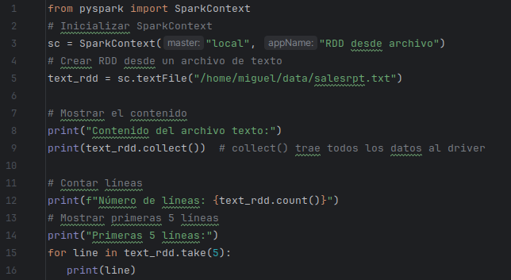

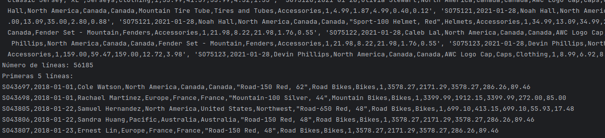

**Creación de un RDD desde múltiples archivos**

Es posible recuperar una lista de archivos desde un directorio definido

```
from pyspark import SparkContext

\# Inicializar SparkContext

sc = SparkContext(\"local\", \"RDD desde varios archivo\")

\# Leer múltiples archivos (pueden usar patrones como \*.txt)

multi_rdd = sc.textFile(\"/home/miguel/data/dirtxt/\*.txt\")

print(multi_rdd.collect())

\# collect() trae todos los datos al driver

\# Contar líneas

print(\"Conteo total de líneas en todos los archivos:\",
multi_rdd.count())

\# Mostrar primeras 5 líneas

print(\"Primeras 5 líneas:\")

for line in multi_rdd.take(5):

print(line)
```

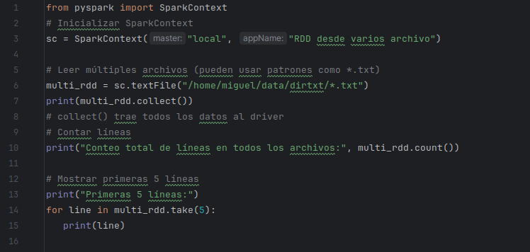

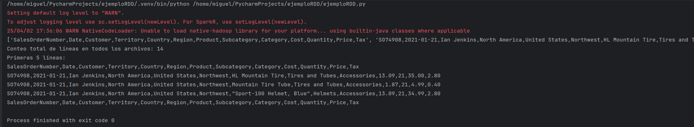

**Notas importantes**

-   `collect()` trae todos los datos al driver, solo úsalo con conjuntos
    pequeños.

-   Para conjuntos grandes, utiliza `take(n)` o `first()`.

-   Los RDD son inmutables (no se pueden modificar después de crearse).

-   Es mejor usar `DataFrames` para datos estructurados, en la mayoría de los casos.

### Tarea 4. Inspeccionar el contenido de un RDD

Se pueden usar acciones como `collect()`, `take()`, o `first()` para
inspeccionar los datos del RDD.
```
from pyspark import SparkContext

sc = SparkContext("local", "Consulta RDD")

rdd = sc.parallelize(\[(1, "Alicia", 25), (2, "Bernardo", 30), (3,
"Carla", 35)\])

print(rdd.collect()) \# Ver todos los datos

print(rdd.take(2)) \# Ver los primeros 2 elementos

print(rdd.first()) \# Ver el primer elemento
```

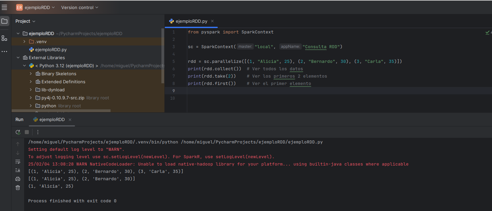

- Leer usando SparkContext.
```
\# Crear SparkContext

sc = SparkContext("local", "RDD desde CSV")

\# Leer el archivo CSV

rdd = sc.textFile("ruta/al/archivo.csv")

\# Procesar las líneas para dividirlas en columnas

header = rdd.first() \# Obtener la primera línea (encabezado)

rdd_data = rdd.filter(lambda line: line != header) \# Filtrar el
encabezado

rdd_split = rdd_data.map(lambda line: line.split(",")) \# Dividir cada
línea por comas

\# Mostrar las primeras filas

print(rdd_split.take(5))
```

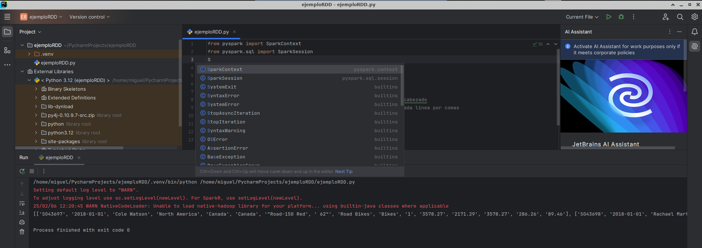


### Tarea 5. Guardar un RDD

En PySpark, se pueden guardar RDD en diferentes tipos de archivos
utilizando varios métodos. Para estos ejemplos, usaremos un directorio
llamado salidas.
```
mkdir \~/salidas
```

**Guardar RDD como archivo de texto**

```
rdd.saveAsTextFile("ruta/del/archivo")
```

Este método guarda el RDD como un archivo de texto en la ruta
especificada. Cada elemento del RDD se guarda en una nueva línea.
```
\# Crear una SparkSession

spark = SparkSession.builder.appName("GuardarRDDs").getOrCreate()

\# Crear un RDD

data = \[("Alice", 1), ("Bob", 2), ("Charlie", 3)\]

rdd = spark.sparkContext.parallelize(data)

\# Convertir el RDD a un DataFrame

df = spark.createDataFrame(rdd, \["nombre", "id"\])

\# Guardar el DataFrame como archivo Parquet

df.write.parquet("ruta/a/parquet")
```

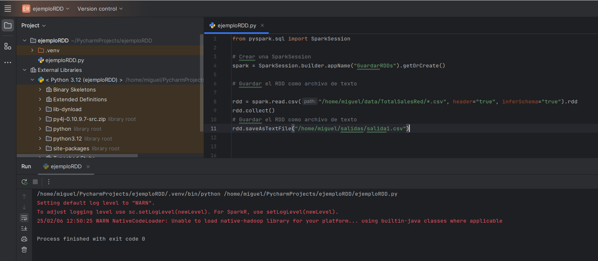

Y si, desde una ventana de `Terminal`, consultas la ruta, aparecerá el
archivo.

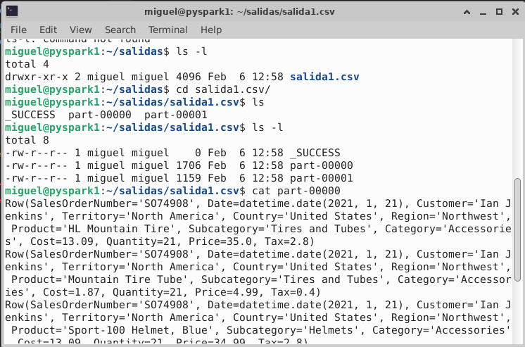

**Guardar RDD como archivo SequenceFile**

Este método guarda el RDD como un `SequenceFile`, que es un formato
binario utilizado por Hadoop.
```
rdd.saveAsSequenceFile("ruta/del/archivo")
```
**Guardar RDD como archivo Parquet**

Para guardar un RDD como archivo Parquet, primero debes convertirlo a un
DataFrame.
```
from pyspark.sql import SparkSession

spark = SparkSession.builder.appName("GuardarRDD").getOrCreate()

\# Convertir RDD a DataFrame

df = rdd.toDF(\["columna1", "columna2"\])

\# Guardar DataFrame como archivo Parquet

df.write.parquet("ruta/del/archivo")

Guardar RDD como archivo JSON
```

De manera similar, se puede convertir el RDD a un DataFrame y luego
guardarlo como un archivo JSON.

```
\# Convertir RDD a DataFrame

df = rdd.toDF(\["columna1", "columna2"\])

\# Guardar DataFrame como archivo JSON

df.write.json("ruta/del/archivo")
```

**Guardar RDD como archivo CSV**

Para guardar un RDD como archivo CSV, también se debe convertir a un
DataFrame.
```
\# Convertir RDD a DataFrame

df = rdd.toDF(\["columna1", "columna2"\])

\# Guardar DataFrame como archivo CSV

df.write.csv("ruta/del/archivo")
```
