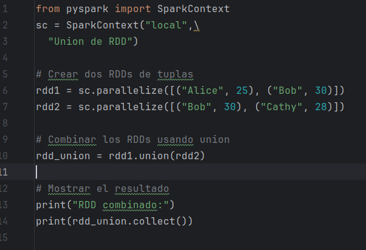
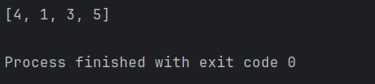
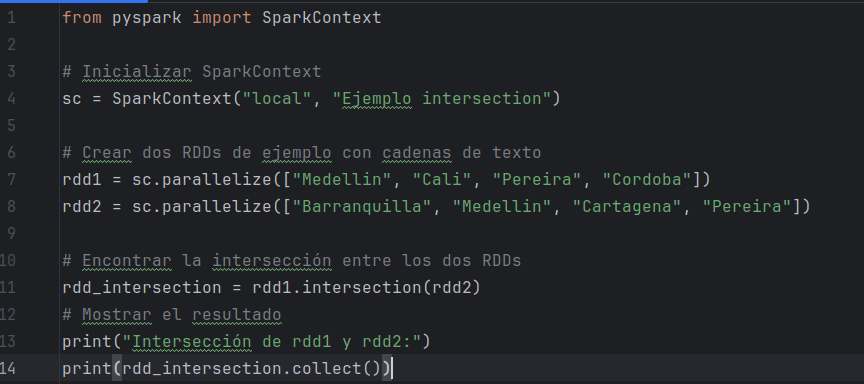
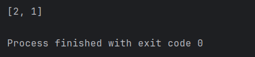
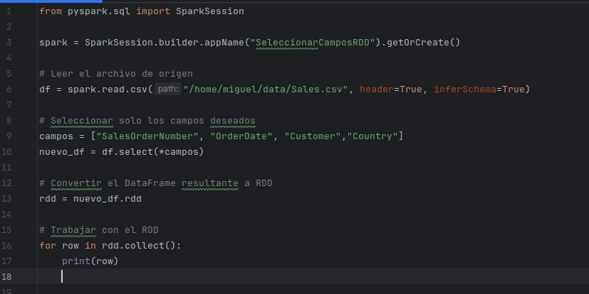
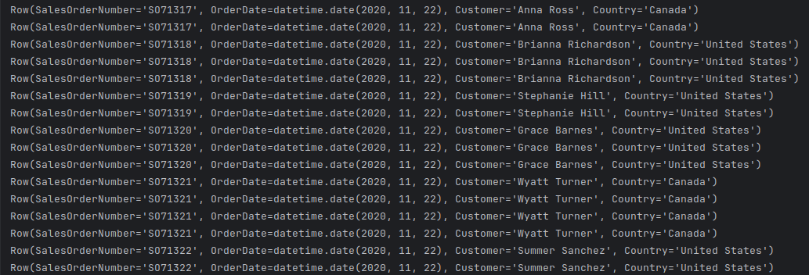
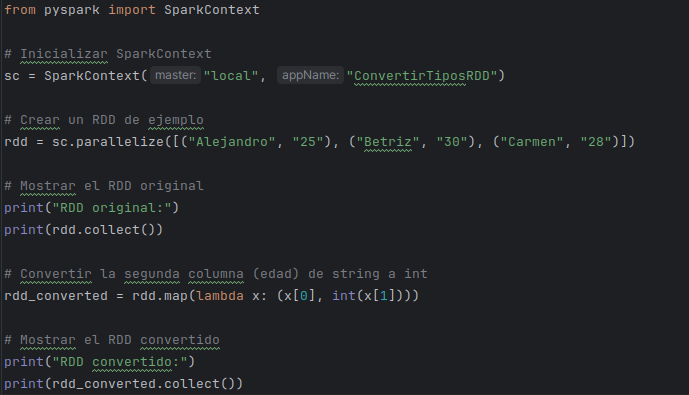
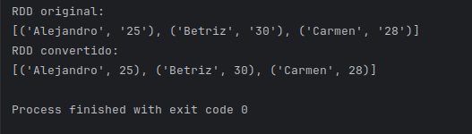

# Práctica 3. Uso de funciones de transformación

**Objetivo de la práctica:**

Al finalizar la práctica serás capaz de:
- Entender y aplicar funciones de transformación sobre RDD.

**Duración aproximada:**
- 60 minutos.

**Prerequisitos:**

- Acceso a ambiente Linux (credenciales provistas en el curso) o Linux local con interfaz gráfica.
- Haber completado el laboratorio 1.
- Haber descargado los archivos de datos.

**Contexto:**

Los RDD admiten dos tipos de operaciones: 
- Transformaciones, crean un nuevo conjunto de datos a partir de uno existente.
- Acciones, que devuelven un valor al programa controlador después de ejecutar un cálculo en el conjunto de datos.

Todas las transformaciones de Spark son diferidas (lazzy), en el sentido de que no calculan sus resultados de inmediato. En su lugar, solo recuerdan las transformaciones aplicadas a algún conjunto de datos base (por ejemplo, un archivo). Las transformaciones solo se calculan cuando una acción requiere que se devuelva un resultado al programa controlador. Este diseño permite que Spark se ejecute de forma más eficiente. Por ejemplo, podemos darnos cuenta de que un conjunto de datos creado a través de un mapa se utilizará en una reducción y devolverá solo el resultado de la reducción al controlador, en lugar del conjunto de datos mapeado más grande.

**Tipos de Transformaciones en RDDs**

> Hay varias clasificaciones de de transformaciones asociadas al proceso que realizan las transformaciones: de ajuste (narrow), amplias (wide)

-   Transformaciones de un solo RDD:

> Operaciones que se aplican a un único RDD.
>
> Ejemplos: map(), filter(), flatMap(), distinct(), sample(), etc.

-   Transformaciones entre dos RDDs:

> Operaciones que involucran dos RDDs.
>
> Ejemplos: union(), intersection(), subtract(), cartesian(), etc.


## Trabajando con esquemas (schema)

Los esquemas en RDDs proporcionan una forma de definir la estructura de los datos dentro de un RDD, especificando los nombres y tipos de las columnas. Esto permite a PySpark optimizar el procesamiento de los datos y realizar operaciones más eficientes.

¿Por qué usar esquemas en RDDs?

- **Mejor rendimiento:** Al definir un esquema, PySpark puede optimizar las consultas y transformaciones, lo que se traduce en un procesamiento más rápido y eficiente.

- **Validación de datos:** Los esquemas permiten validar los datos al momento de cargarlos o procesarlos, asegurando que cumplan con la estructura definida.

- **Mayor legibilidad:** Al tener una estructura clara y definida, el código es más fácil de entender y mantener.

- **Integración con otras herramientas:** Los esquemas facilitan la integración con otras herramientas y librerías, como DataFrames y SQL.

Instrucciones:

### Tarea 1: Creando RDD con esquema a partir de un archivo CSV

Iniciamos la sesión de PyCharm:

```pycharm-community```

Creamos un archivo Python e introducimos el siguiente código. 
Se ajusta la ruta al archivo `Customers.cvs`

```
from pyspark.sql import SparkSession

from pyspark.sql.types import StructType, StructField, StringType

spark = SparkSession.builder.appName("CSVConEsquema").getOrCreate()

#Se describe la estructura a leer

schema = StructType([
  StructField("ID", StringType(), True),
  StructField("Name", StringType(), True),
  StructField("Address", StringType(), True),
  StructField("Gender", StringType(), True),
  StructField("Status", StringType(), True)
])

rdd = spark.sparkContext.textFile("/home/miguel/data/Model/Customers.csv")

#Se elimina el encabezado

encabezado = rdd.zipWithIndex().filter(lambda x: x[1] &gt; 0).map(lambda x: x[0])

#Se convierte el RDD a DataFrame

rdd_con_esquema = encabezado.map(lambda linea: linea.split(",")).toDF(schema)

rdd_con_esquema.show()

rdd_con_esquema.printSchema()

```


En este ejemplo: Primero, se carga el archivo CSV utilizando textFile(). Luego, se omite la primera línea si contiene encabezados. Después, se divide cada línea en campos utilizando split(","). Finalmente, se crea el RDD con esquema utilizando toDF(schema).

-   Es importante asegurarse de que los tipos de datos en el archivo CSV coinciden con los tipos de datos definidos en el esquema.
-   Si el archivo CSV contiene encabezados, es necesario omitirlos al crear el RDD con esquema.
-   Si el archivo CSV contiene valores nulos, se pueden manejar utilizando la opción nullable=True en la definición del esquema.

**Leyendo desde archivo parquet con esquema**

```

from pyspark.sql import SparkSession
from pyspark.sql.types import StructType, StructField, StringType, IntegerType, LongType

spark = SparkSession.builder \
  .master("local") \
  .appName("RDDdesdeParquet") \
  .getOrCreate()

sc = spark.sparkContext

esquema = StructType([
  StructField("Precio", LongType(), True),
  StructField("Area", LongType(), True),
  StructField("Recamaras", IntegerType(), True),
  StructField("Baños", IntegerType(), True),
  StructField("Historias", LongType(), True),
  StructField("CallePrincipal", StringType(), True),
  StructField("CuartoInvitados", StringType(), True),
  StructField("Sotano", StringType(), True),
  StructField("AguaCaliente", StringType(), True),
  StructField("AireAcondicionado", StringType(), True),
  StructField("Estacionamiento", IntegerType(), True),
  StructField("AreaPreferida", StringType(), True),
  StructField("EstadoMobiliario", StringType(), True)
])

#Cargar el archivo parquet
df = spark.read.parquet("/home/miguel/data/house-price.parquet")

#Convertir el DataFrame a rdd
rdd=df.rdd
#Convertir el DataFrame a rdd
rdd_esquema = rdd.toDF(esquema).rdd

#Alguna actividad con el rdd
for row in rdd\_esquema.collect():
    print(row)

df.show(5, 0)
df.printSchema()

```


**Recomendaciones**

-   Utilizar DataFrames cuando sea posible: Si bien es posible crear RDDs con esquemas desde archivos Parquet, se recomienda utilizar DataFrames directamente, ya que ofrecen un mejor rendimiento y funcionalidades para el procesamiento de datos estructurados.

-   Definir esquemas explícitos: Si necesitas un control preciso sobre el esquema de los datos, define un esquema explícito utilizando StructType y StructField.

### Tarea 2: Aplicando transformaciones

**Características de las transformaciones:**

-   **Perezosas (Lazy Evaluation):** Las transformaciones no se ejecutan hasta que se llama a una acción (como collect(), count(), saveAsTextFile(), etc.) Esto permite optimizar el plan de ejecución.

-   **Inmutabilidad:** Los RDDs son inmutables, lo que significa que las transformaciones no modifican el RDD original, sino que generan uno nuevo.

-   **Lineage (Linaje):** PySpark mantiene un registro de las transformaciones aplicadas a un RDD, lo que permite recalcular datos en caso de fallos.

Queremos procesar un conjunto de frases para contar la frecuencia de cada palabra:

```
from pyspark import SparkContext
sc = SparkContext("local", "ConteoPalabras")

# Crear un RDD a partir de una lista de frases
frases = ["Error: usuario magarcia2 no existe", "Error: usuario magarcia2 llego al limite de accesos en dragonlair", "Aviso: servidor dragonlair degradado"]
rdd = sc.parallelize(frases)

# Dividir frases en palabras
rdd_palabras = rdd.flatMap(lambda x: x.split(" "))

# Convertir a mayúsculas
rdd_palabras_mayusculas = rdd_palabras.map(lambda x: x.upper())

# Contar frecuencia
rdd_frecuencia = rdd_palabras_mayusculas.map(lambda x: (x, 1)).reduceByKey(lambda a, b: a + b)

# Ejecutar acción para obtener resultados
resultado = rdd_frecuencia.collect()
print(resultado)

```


## Tarea 3: Aplicando transformaciones comunes

### Función map

La función map es una de las transformaciones más comunes y poderosas que se pueden aplicar a un RDD. Toma una función como argumento y la aplica a cada elemento del RDD, devolviendo un nuevo RDD con los resultados.

La función que pasas a map se aplica a cada elemento del RDD, uno por uno. Devuelve un nuevo RDD donde cada elemento es el resultado de aplicar la función al elemento original.

`salida= entrada.map(funcion())`

La función map toma como argumento una función (por ejemplo, una función de Python o una lambda) que se aplica a cada elemento del RDD.

Devuelve un nuevo RDD donde cada elemento es el resultado de aplicar la función al elemento original.

**Convertir todos los elementos de un RDD a mayúsculas.**

```
from pyspark import SparkContext

sc = SparkContext("local",\
"Transformaciones RDD")

rdd = sc.parallelize(["hola", "mundo", "pyspark"])
rdd_mayusculas = rdd.map(lambda x: x.upper())

print(rdd_mayusculas.collect())
```


**Transformar tuplas**

Se tiene un RDD de tuplas que representan nombres y edades, y se desea incrementar la edad de cada persona en 2.

```
from pyspark import SparkContext

sc = SparkContext("local",\
"Transformar tuplas RDD")

# Crear un RDD de tuplas
rdd = sc.parallelize(\[("Alicia", 25), ("Bernardo", 30), ("Carolina", 28)\])

# Aplicar la función map para incrementar la edad en 2
rdd_transformado = rdd.map(lambda x: (x[0], x[1] + 2))

# Mostrar el resultado
print(rdd_transformado.collect())

```


**Transformar cadenas de texto**

Convertir cada cadena a mayúsculas.

```
from pyspark import SparkContext

sc = SparkContext("local",\
"Transformar Texto en RDD")

# Crear un RDD de tuplas
rdd = sc.parallelize(["Alicia","Bernardo","Carolina"])

# Aplicar la función map para convertir a mayúsculas
rdd_transformado = rdd.map(lambda x: x.upper())

# Mostrar el resultado
print(rdd_transformado.collect())

```


**Transformaciones más complejas**

Puedes usar map para realizar transformaciones más complejas, como extraer información de un formato de datos.

```
from pyspark import SparkContext

sc = SparkContext("local",\
"Transformar Texto en RDD")

# Crear un RDD de cadenas en formato "nombre:edad"
rdd = sc.parallelize(["Alice:25", "Bob:30", "Cathy:28"])

# Aplicar la función map para extraer nombre y edad
rdd_transformado = rdd.map(lambda x: (x.split(":")[0], int(x.split(":")[1])))

# Mostrar el resultado
print(rdd_transformado.collect())

```


### Función flatMap

**flatMap** - transformación que se aplica a un RDD y devuelve un nuevo RDD. La diferencia principal con la transformación map es que flatMap puede "aplanar" los resultados.

-   **map**: Aplica una función a cada elemento del RDD y devuelve un nuevo RDD con los resultados. Si la función devuelve una lista o secuencia, cada elemento de esa lista se mantiene como un elemento separado en el nuevo RDD.

-   **flatMap**: Aplica una función a cada elemento del RDD y devuelve un nuevo RDD con los resultados. Si la función devuelve una lista o secuencia, flatMap "aplana" esa lista, de modo que los elementos individuales de la lista se convierten en elementos separados en el nuevo RDD.

flatMap es útil cuando tienes un RDD donde cada elemento contiene una colección (como una lista) y deseas crear un nuevo RDD donde cada elemento sea un elemento individual de esas colecciones.

Si aplicamos map para dividir cada frase en palabras, obtendríamos un RDD donde cada elemento es una lista de palabras:

```
palabras_map = rdd.map(lambda frase: frase.split())

# Resultado: [['Hola', 'mundo'], ['Python', 'es', 'genial'], ['Spark', 'es', 'poderoso']]

```

Pero si usamos flatMap, obtenemos un RDD donde cada palabra es un elemento individual:

```
palabras\_flat = rdd.flatMap(lambda frase: frase.split())
```

**Extrayendo términos**

```
from pyspark import SparkContext

sc = SparkContext("local", "Aplicando flatMap")
frases = ["Error de aplicación web",\
          "Aviso de recursos al límite",\
          "Error de seguridad en aplicación local"]

rdd = sc.parallelize(frases)

palabras_map = rdd.map(lambda frase: frase.split())
palabras_flat = rdd.flatMap(lambda frase: frase.split())

print("Resultado con map:")
for palabras in palabras_map.collect():
    print(palabras)

print("nResultado con flatMap:")
for palabra in palabras_flat.collect():
    print(palabra)

```


### Función filter

**filter()** - Transformación que se utiliza para seleccionar elementos de un RDD que cumplen con una condición específica. La función filter toma una función (o una expresión lambda) que devuelve True o False para cada elemento del RDD. Solo los elementos que devuelven True se incluyen en el nuevo RDD resultante.

**Sintaxis de filter**

`nuevo_rdd = rdd.filter(función)`

**rdd:** El RDD original.
**función:** Una función que toma un elemento del RDD y devuelve True o False.
**nuevo_rdd:** El RDD resultante que contiene solo los elementos que cumplen la condición.

**Filtrar números pares.**

```
from pyspark import SparkContext

sc = SparkContext("local",\
  "Filtrar RDD")

rdd = sc.parallelize([1, 2, 3, 4, 5, 6])
rdd_pares = rdd.filter(lambda x: x % 2 == 0)

print(rdd_pares.collect())

```


**Filtrar filas basadas en una condición**

Se tiene un RDD de tuplas que representan personas con su nombre y edad, y se desea filtrar solo las personas mayores de 25 años.

```
from pyspark import SparkContext

# Inicializar SparkContext
sc = SparkContext("local", "FilterEjemplo")

# Crear un RDD de personas (nombre, edad)
rdd = sc.parallelize([("Alice", 25), ("Bob", 30), ("Cathy", 28), ("David", 22)])

# Filtrar personas mayores de 25 años
rdd_mayores = rdd.filter(lambda x: x[1] &gt; 25)

# Mostrar el resultado
print("Personas mayores de 25 años:")
print(rdd_mayores.collect())

```


**Filtrar usando una función definida**

En lugar de usar una expresión lambda, se puede definir una función para realizar el filtrado. Esto es útil cuando la lógica de filtrado es más compleja.

```
from pyspark import SparkContext
# Inicializar SparkContext
sc = SparkContext("local", "FilterEjemplo")

# Crear un RDD de personas (nombre, edad)
rdd = sc.parallelize(\[("Alice", 25), ("Bob", 30), ("Cathy", 28), ("David", 22)])

# Definir una función de filtrado
def es_mayor_de_25(persona):
    nombre, edad = persona
    return edad &gt; 25

# Filtrar usando la función
rdd_mayores = rdd.filter(es_mayor_de_25)

# Mostrar el resultado
print("Personas mayores de 25 años:")
print(rdd_mayores.collect())

```


**Filtrar basado en múltiples condiciones**

Se pueden combinar múltiples condiciones usando operadores lógicos como and, or, etc.

```
from pyspark import SparkContext

sc = SparkContext("local", "FilterEjemplo")

# Crear un RDD de personas (nombre, edad, ciudad)
rdd = sc.parallelize(\[
    ("Alice", 25, "Medellin"),
    ("Bob", 30, "Bogotá"),
    ("Cathy", 28, "Bogotá"),
    ("David", 22, "Cali"),
    ("Ernesto", 21, "Bogotá"),
    ("Fernanda", 20, "Medellin"),
])

# Filtrar personas que viven en Bogotá y tienen más de 25 años
rdd_filtrado = rdd.filter(lambda x: x[2] == "Bogotá" and x[1] &gt; 25)

# Mostrar el resultado

print("Personas que viven en Bogotá y tienen más de 25 años:")
print(rdd_filtrado.collect())

```


### 

### Función distinct

**distinct** - se utiliza para eliminar duplicados en un RDD. Esta función devuelve un nuevo RDD que contiene solo los elementos únicos del RDD original. Es una operación útil cuando necesitas eliminar filas o registros repetidos en un conjunto de datos.

salida = entrada.distinct()

-   entrada: Un RDD con elementos que pueden contener duplicados.
-   salida: Un nuevo RDD donde cada elemento aparece solo una vez (sin duplicados).

La función distinct() realiza un **shuffle** internamente para agrupar y eliminar los duplicados. Esto puede ser costoso en términos de rendimiento, especialmente con grandes volúmenes de datos

**Obtener elementos únicos.**

```
from pyspark import SparkContext
sc = SparkContext("local",\
  "Distinct en RDD")

# Crear un RDD con elementos duplicados
rdd = sc.parallelize([1, 2, 3, 4, 2, 3, 5, 6, 1])

# Aplicar la función distinct() para eliminar duplicados
rdd_distinct = rdd.distinct()

# Mostrar el RDD resultante
print("RDD original:", rdd.collect())
print("RDD sin duplicados:", rdd_distinct.collect())

```


**Eliminar filas duplicadas**

En un RDD de tuplas, distinct() eliminará las tuplas duplicadas en su totalidad.

from pyspark import SparkContext

\# Inicializar SparkContext

sc = SparkContext("local", "DistinctTuplesExample")

\# Crear un RDD de tuplas con duplicados

rdd = sc.parallelize(\[("Alice", 25), ("Bob", 30), ("Alice", 25), ("Cathy", 28)\])

\# Aplicar distinct() para eliminar tuplas duplicadas

rdd\_distinct = rdd.distinct()

\# Mostrar el RDD resultante

print("RDD original:", rdd.collect())

print("RDD sin duplicados:", rdd\_distinct.collect())


**Eliminar duplicados basados en una "columna"**

Si deseas eliminar duplicados basados en una "columna" específica (un elemento de la tupla), puedes usar **map** para seleccionar esa columna y luego aplicar **distinct**(). Después, puedes unir los datos originales con los elementos únicos.

from pyspark import SparkContext

sc = SparkContext("local", "DistinctColumnExample")

\# Crear un RDD de tuplas

rdd = sc.parallelize(\[("Alice", 25), ("Bob", 30), ("Alice", 25), ("Cathy", 28)\])

\# Seleccionar la columna "nombre" (primer elemento de la tupla) y aplicar distinct()

nombres\_unicos = rdd.map(lambda x: x\[0\]).distinct()

\# Mostrar los nombres únicos

print("Nombres únicos:", nombres\_unicos.collect())

\# Filtrar el RDD original para mantener solo las filas con nombres únicos

rdd\_filtrado = rdd.map(lambda x: (x\[0\], x)).join(nombres\_unicos.map(lambda x: (x, 1))).map(lambda x: x\[1\]\[0\])

\# Mostrar el RDD filtrado

print("RDD filtrado:", rdd\_filtrado.collect())


**En este ejemplo:**

-   Usamos map(lambda x: x\[0\]) para seleccionar solo la primera columna (el nombre).

-   Eliminamos los duplicados en la columna seleccionada con **distinct**().

-   Usamos **join** para combinar el RDD original con los nombres únicos.

-   Finalmente, mapeamos el resultado para obtener solo las filas originales sin duplicados.

### Función union

**union**: la función union se utiliza para combinar dos RDDs en uno solo. Esta función retorna un nuevo RDD que contiene todos los elementos de ambos RDDs originales. Es importante destacar que union no elimina duplicados; si los RDDs tienen elementos repetidos, estos se mantendrán en el RDD resultante.

rdd\_resultante = rdd1.union(rdd2)

-   rdd1: El primer RDD.

-   rdd2: El segundo RDD.

-   rdd\_resultante: Un nuevo RDD que contiene todos los elementos de rdd1 y rdd2.

**Unir dos listas.**

from pyspark import SparkContext

sc = SparkContext("local",\\

"Union de RDD")

rdd1 = sc.parallelize(\[1, 2, 3, 4\])

rdd2 = sc.parallelize(\[3, 4, 5, 6\])

\# Combinar los RDDs usando union

rdd\_union = rdd1.union(rdd2)

\# Mostrar el resultado

print("RDD combinado:")

print(rdd\_union.collect())


**RDDs de tuplas**

También puedes usar union con RDDs que contienen estructuras más complejas, como tuplas.

from pyspark import SparkContext

sc = SparkContext("local",\\

"Union de RDD")

\# Crear dos RDDs de tuplas

rdd1 = sc.parallelize(\[("Alice", 25), ("Bob", 30)\])

rdd2 = sc.parallelize(\[("Bob", 30), ("Cathy", 28)\])

\# Combinar los RDDs usando union

rdd\_union = rdd1.union(rdd2)

\# Mostrar el resultado

print("RDD combinado:")

print(rdd\_union.collect())




union no elimina duplicados. Si necesitas eliminar elementos repetidos, puedes usar la función distinct después de aplicar union.

rdd\_sin\_duplicados = rdd\_union.distinct()

print(rdd\_sin\_duplicados.collect())

union no garantiza un orden específico en el RDD resultante. Los elementos se combinan en el orden en que se encuentran en los RDDs originales.

### Función intersection

**intersection -** permite encontrar los elementos comunes entre dos RDDs. Devuelve un nuevo RDD que contiene solo los elementos que están presentes en ambos RDDs originales.

-   Ambos RDDs deben contener elementos del mismo tipo para que la operación sea válida.

-   intersection implica un **shuffle** (reorganización de datos entre particiones), lo que puede ser costoso en términos de rendimiento, especialmente con grandes volúmenes de datos.

-   El RDD resultante no contendrá elementos duplicados, incluso si los RDDs originales los tenían.

rdd1.intersection(rdd2)

-   rdd1: Primer RDD.

-   rdd2: Segundo RDD.

**Intersección de dos listas.**

from pyspark import SparkContext

sc = SparkContext("local",\\

"Transformaciones RDD")

rdd1 = sc.parallelize(\[1, 2, 3, 4, 5, 6\])

rdd2 = sc.parallelize(\[1, 3, 4, 5,7\])

rdd\_interseccion = rdd1.intersection(rdd2)

print(rdd\_interseccion.collect())




**intersection con cadenas de texto**

También puedes usar intersection con RDDs que contengan cadenas de texto.

from pyspark import SparkContext

\# Inicializar SparkContext

sc = SparkContext("local", "Ejemplo intersection")

\# Crear dos RDDs de ejemplo con cadenas de texto

rdd1 = sc.parallelize(\["Medellin", "Cali", "Pereira", "Cordoba"\])

rdd2 = sc.parallelize(\["Barranquilla", "Medellin", "Cartagena", "Pereira"\])

\# Encontrar la intersección entre los dos RDDs

rdd\_intersection = rdd1.intersection(rdd2)

\# Mostrar el resultado

print("Intersección de rdd1 y rdd2:")

print(rdd\_intersection.collect())




### Función substract

**subtract -** se utiliza para obtener los elementos que están en un RDD pero no en otro. Realiza una diferencia de conjuntos entre dos RDDs. El resultado es un nuevo RDD que contiene solo los elementos que están en el primer RDD y no en el segundo.

resultado\_rdd = rdd1.subtract(rdd2)

-   rdd1: El RDD del cual se quieren extraer los elementos.

-   rdd2: El RDD cuyos elementos se quieren excluir del primer RDD.

-   resultado\_rdd: Un nuevo RDD que contiene los elementos de rdd1 que no están en rdd2.

**Restar dos listas.**

from pyspark import SparkContext

sc = SparkContext("local", "Substract con RDD")

rdd1 = sc.parallelize(\[1, 2, 3, 4\])

rdd2 = sc.parallelize(\[3, 4, 5, 8\])

rdd\_diferencia = rdd1.subtract(rdd2)

print(rdd\_diferencia.collect())




**Usando tuplas**

La función subtract también funciona con RDDs que contienen tuplas o estructuras más complejas.

from pyspark import SparkContext

sc = SparkContext("local", "Subtract tuplas")

\# Crear los RDDs con tuplas

rdd1 = sc.parallelize(\[("Alice", 25), ("Bob", 30), ("Cathy", 28)\])

rdd2 = sc.parallelize(\[("Bob", 30), ("David", 40)\])

\# Usar subtract para obtener las tuplas de rdd1 que no están en rdd2

resultado\_rdd = rdd1.subtract(rdd2)

\# Mostrar el resultado

print("Tuplas en rdd1 que no están en rdd2:")

print(resultado\_rdd.collect())

subtract compara los elementos de los RDDs de manera exacta. Para tuplas o estructuras complejas, todos los elementos de la tupla deben coincidir para que se considere un duplicado.

### Función cartesian

**cartesian -** se utiliza para calcular el producto cartesiano entre dos RDDs. El producto cartesiano de dos conjuntos (o RDDs) es un conjunto de pares ordenados donde el primer elemento pertenece al primer RDD y el segundo elemento pertenece al segundo RDD.Ejemplo: Producto cartesiano de dos listas.

Toma dos RDDs, RDD1 y RDD2.

Devuelve un nuevo RDD que contiene todas las combinaciones posibles de elementos entre RDD1 y RDD2.

El tamaño del RDD resultante es el producto de los tamaños de RDD1 y RDD2. Por ejemplo, si RDD1 tiene 3 elementos y RDD2 tiene 2 elementos, el RDD resultante tendrá 3×2=6 elementos.

from pyspark import SparkContext

sc = SparkContext("local",\\

"Producto cartesiano RDD")

\# Crear dos RDDs

rdd1 = sc.parallelize(\[1, 2, 3\])

rdd2 = sc.parallelize(\["A", "B"\])

\# Calcular el producto cartesiano

cartesian\_rdd = rdd1.cartesian(rdd2)

\# Mostrar el resultado

print("Producto cartesiano:")

print(cartesian\_rdd.collect())

El producto cartesiano puede generar un RDD muy grande, ya que su tamaño es el producto de los tamaños de los dos RDDs originales.

Por ejemplo, si rdd1 tiene 1,000 elementos y rdd2 tiene 1,000 elementos, el RDD resultante tendrá 1,000,000 de elementos. Esto puede consumir mucha memoria y tiempo de procesamiento.

El producto cartesiano es útil en casos donde necesitas comparar o combinar todos los elementos de un conjunto con todos los elementos de otro conjunto.

### Función groupByKey

**groupByKey** - es una transformación que se aplica a RDDs que contienen pares clave-valor. Su propósito es agrupar todos los valores que comparten la misma clave en una sola colección. El resultado es un nuevo RDD donde cada clave única está asociada a un iterable de todos los valores correspondientes a esa clave.

from pyspark import SparkContext

sc = SparkContext("local", "groupByKey\_example")

data = \[

("Juan", "Matemáticas", 8),

("María", "Ciencias", 9),

("Juan", "Física", 7),

("Pedro", "Matemáticas", 6),

("María", "Química", 8),

("Pedro", "Física", 9)

\]

rdd = sc.parallelize(data)

grouped\_rdd = rdd.map(lambda x: (x\[0\], (x\[1\], x\[2\]))).groupByKey()

for student, grades in grouped\_rdd.collect():

print(f"Estudiante: {student}")

for subject, grade in grades:

print(f" {subject}: {grade}")


-   groupByKey puede ser costoso en términos de rendimiento, ya que implica mezclar todos los datos con la misma clave en un solo lugar. Si necesitas realizar operaciones de agregación (como sumas o promedios), es más eficiente usar reduceByKey o aggregateByKey.

-   El resultado de groupByKey es un RDD donde los valores son iterables.

-   Si necesitas realizar una operación de reducción (como suma, promedio, máximo, etc.) sobre los valores agrupados, reduceByKey es una opción más eficiente.

-   aggregateByKey es similar a reduceByKey, pero ofrece más flexibilidad para inicializar y combinar los valores.

### Función reduceByKey

**reduceByKey** - transformación que se aplica a RDDs que contienen pares clave-valor. Su objetivo es combinar los valores que comparten la misma clave, utilizando una función de reducción. Esta función debe ser asociativa y conmutativa para garantizar resultados consistentes.

-   reduceByKey agrupa todos los pares clave-valor que tienen la misma clave.

-   Para cada grupo de valores con la misma clave, se aplica la función de reducción para obtener un único valor combinado.

-   Se crea un nuevo RDD donde cada clave única está asociada al valor combinado resultante.

**Información de ventas de diferentes productos**

from pyspark import SparkContext

sc = SparkContext("local", "ReduceByKey\_Example")

data = \[

("ProductoA", 10),

("ProductoB", 5),

("ProductoA", 15),

("ProductoC", 8),

("ProductoB", 12)

\]

rdd = sc.parallelize(data)

total\_ventas = rdd.reduceByKey(lambda a, b: a + b)

\# Mostrar el resultado

for producto, ventas in total\_ventas.collect():

print(f"Producto: {producto}, Ventas totales: {ventas}")

En este ejemplo:

-   rdd.reduceByKey(lambda a, b: a + b): Aplica la función reduceByKey al RDD. La función lambda a, b: a + b es la función de reducción que suma los valores.

-   La función de reducción debe ser asociativa y conmutativa. Por ejemplo, la suma (a + b) lo es, pero la resta (a - b) no lo es.

-   reduceByKey es una operación eficiente para grandes conjuntos de datos, ya que realiza la reducción de forma distribuida.

-   Es importante recordar que reduceByKey opera sobre RDDs de pares clave-valor.

**Además de la suma, se pueden usar otras funciones de reducción como:**

-   Máximo: lambda a, b: max(a, b)

-   Mínimo: lambda a, b: min(a, b)

-   Multiplicación: lambda a, b: a \* b

### Función sortByKey

**sortByKey -** se utiliza en RDDs que contienen pares clave-valor. Su propósito es ordenar los elementos del RDD basándose en las claves. Por defecto, ordena de forma ascendente, pero esto se puede cambiar.

sortByKey(ascending=True, numPartitions=None, keyfunc=lambda x: x)

-   ascending: Booleano. True para orden ascendente (predeterminado), False para descendente.

-   numPartitions: Entero. Número de particiones para el RDD resultante.

-   keyfunc: Función que se aplica a las claves antes de la ordenación.

from pyspark import SparkContext

sc = SparkContext("local", "SortByKey")

data = \[("manzana", 10), ("banana", 20), ("naranja", 5), ("uva", 15)\]

rdd = sc.parallelize(data)

sorted\_rdd = rdd.sortByKey()

for fruta, cantidad in sorted\_rdd.collect():

print(f"{fruta}: {cantidad}")

from pyspark import SparkContext

sc = SparkContext("local", "SortByKey")

data = \[("manzana", 10), ("banana", 20), ("naranja", 5), ("uva", 15)\]

rdd = sc.parallelize(data)

sorted\_rdd = rdd.sortByKey(ascending=False)

for fruta, cantidad in sorted\_rdd.collect():

print(f"{fruta}: {cantidad}")

-   sortByKey solo funciona en RDDs de pares clave-valor.

-   La ordenación se realiza dentro de cada partición del RDD. Si necesitas una ordenación global, puedes usar repartition(1) para tener una sola partición.

-   Si tienes claves duplicadas, sortByKey no las agrupa, simplemente las ordena según su orden de aparición.

### Filtrado de columnas

**Crear RDD solo con campos seleccionados**

En PySpark, tienes varias formas de crear un RDD con solo algunos campos de un archivo de origen.

La forma más sencilla y eficiente de seleccionar solo algunos campos es usar la función **select**.

Notemos la estructura del archivo Sales.csv


Tenemos más de 10 campos. Y no requerimos en este momento trabajar con todos. Así que solo seleccionaremos los campos necesarios

from pyspark.sql import SparkSession

spark = SparkSession.builder.appName("SeleccionarCamposRDD").getOrCreate()

\# Leer el archivo de origen

df = spark.read.csv("/home/miguel/data/Sales.csv", header=True, inferSchema=True)

\# Seleccionar solo los campos deseados

campos = \["SalesOrderNumber", "OrderDate", "Customer","Country"\]

nuevo\_df = df.select(\*campos)

\# Convertir el DataFrame resultante a RDD

rdd = nuevo\_df.rdd

\# Trabajar con el RDD

for row in rdd.collect():

print(row)





**Usando map para seleccionar campos**

Otra alternativa es utilizar la función **map** para transformar cada elemento del RDD.

from pyspark.sql import SparkSession

spark = SparkSession.builder.appName("SeleccionarCamposRDD")\\

.getOrCreate()

\# Crear un RDD

data = \[("A", 1, "X", True), ("B", 2, "Y", False), ("C", 3, "Z", True)\]

rdd\_original = spark.sparkContext.parallelize(data)

\# Seleccionar solo los campos deseados usando map

indices\_deseados = \[0, 2\] \# Índices de los campos a seleccionar (0 = "A", 2 = "X")

rdd = rdd\_original.map(lambda row: tuple(row\[i\] for i in indices\_deseados))

\# Trabajar con el RDD

for row in rdd.collect():

print(row)

### Convertir tipos de datos en un RDD

Los RDDs no tienen un esquema definido, por lo que no tienen columnas con tipos de datos específicos. Sin embargo, se puede manipular los datos dentro de un RDD para convertir tipos de datos durante el procesamiento.

from pyspark import SparkContext

\# Inicializar SparkContext

sc = SparkContext("local", "ConvertirTiposRDD")

\# Crear un RDD de ejemplo

rdd = sc.parallelize(\[("Alejandro", "25"), ("Betriz", "30"), ("Carmen", "28")\])

\# Mostrar el RDD original

print("RDD original:")

print(rdd.collect())

\# Convertir la segunda columna (edad) de string a int

rdd\_converted = rdd.map(lambda x: (x\[0\], int(x\[1\])))

\# Mostrar el RDD convertido

print("RDD convertido:")

print(rdd\_converted.collect())

**En este ejemplo:**

**map**: Esta transformación aplica una función a cada elemento del RDD. En este caso, la función es una lambda que toma una tupla x y devuelve una nueva tupla donde el primer elemento (x\[0\]) permanece igual, y el segundo elemento (x\[1\]) se convierte a un entero usando int().

**Lambda function: lambda x: (x\[0\], int(x\[1\])):**

> **x\[0\]:** Conserva el primer elemento de la tupla (el nombre).
>
> **int(x\[1\]):** Convierte el segundo elemento de la tupla (la edad) a un entero.





**Consideraciones importantes**

-   **Manejo de errores:** Si algunos valores no se pueden convertir (por ejemplo, si una cadena no es un número válido), se lanzará una excepción. Puedes manejar esto usando bloques try-except dentro de la función map.

-   **Rendimiento:** Las operaciones de transformación en RDDs son perezosas (lazy), lo que significa que no se ejecutan hasta que se llama a una acción (como collect()). Esto permite que Spark optimice el procesamiento.

-   **Uso de DataFrames:** Si estás trabajando con datos estructurados y necesitas convertir tipos de datos con frecuencia, es recomendable usar DataFrames en lugar de RDDs. Los DataFrames tienen soporte integrado para esquemas y conversiones de tipos de datos.

\*\*\*Fin del laboratorio
