# Práctica 3. DataFrames en PySpark

## Duración aproximada
- 45 minutos.

## Instrucciones

### Tarea 1. Creando DataFrames

Los DataFrames en PySpark son una estructura de datos distribuida y
optimizada que permite trabajar con datos estructurados o
semiestructurados de manera mucho más eficiente que los RDD.

Los DataFrames se pueden crear a partir de varias fuentes de datos, como
archivos (CSV, JSON, Parquet), bases de datos, o RDDs.

**Crear un DataFrame desde una lista de datos**

```
from pyspark.sql import SparkSession

spark = SparkSession\\

.builder.appName("Crear DataFrame de lista")\\

.getOrCreate()

\# Crear un DataFrame desde una lista de datos

data = \[("Enero", 34667), ("Febrero", 48795), ("Marzo", 87548)\]

df = spark.createDataFrame(data, \["Mes", "Ingreso"\])

\# Mostrar el DataFrame

df.show()
```

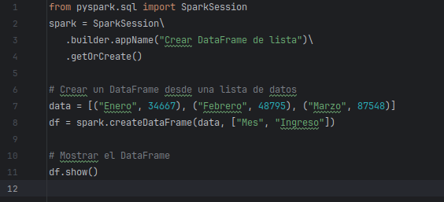

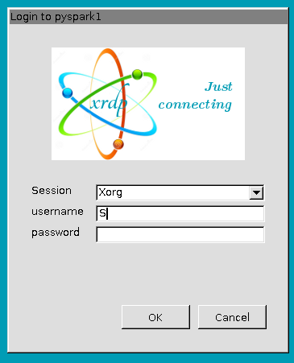

**En este ejemplo:**

-   `spark.createDataFrame()` crea un `DataFrame` a partir de una lista de tuplas.

-   El segundo argumento especifica los nombres de las columnas.

**DataFrame creado a partir de un diccionario**

```
from pyspark.sql import SparkSession

\# Crear una SparkSession

spark = SparkSession.builder.appName("EjemploEsquema").getOrCreate()

\# Crear datos como una lista de diccionarios

data = \[

{"Nombre": "Alfonso", "Edad": 25, "Ciudad": "Abejorral"},

{"Nombre": "Bernado", "Edad": 30, "Ciudad": "Bogota"},

{"Nombre": "Celeste", "Edad": 35, "Ciudad": "Cartagena"}

\]

\# Crear el DataFrame

df = spark.createDataFrame(data)

\# Mostrar la información

df.show()

\# Consultar el esquema del DataFrame

df.printSchema()
```

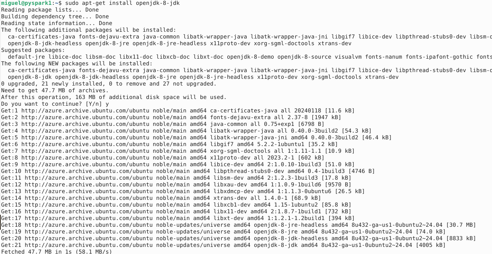

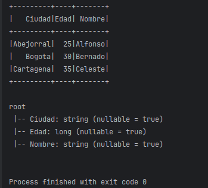

**En este ejemplo:**

-   `createDataFrame` se utiliza para crear el DataFrame desde una colección.

-   `df.printSchema` muestra la estructura de datos inferida.

**Crear un DataFrame desde un archivo CSV**

```
from pyspark.sql import SparkSession

spark = SparkSession\\

.builder\\

.appName("Ejemplo CSV")\\

.getOrCreate()

\# Crear un DataFrame desde un archivo CSV

df = spark.read.csv("/home/miguel/data/Sales.csv")

\# Mostrar el DataFrame y el esquema

df.show(5)

df.printSchema()
```

**En este ejemplo:**

-   `spark.read.csv()` carga un archivo CSV.

-   Nota el primer registro, nombres de columnas y tipos de datos.

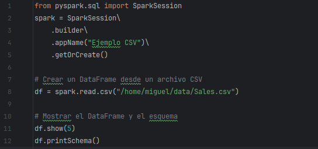

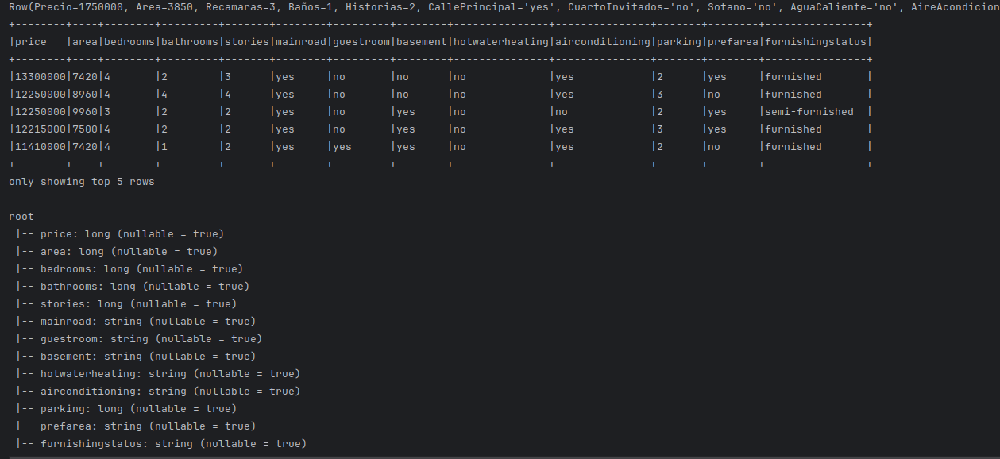

**Crear un DataFrame desde un archivo CSV infiriendo esquema e
identificando encabezados**

```
from pyspark.sql import SparkSession

spark = SparkSession\\

.builder\\

.appName("Ejemplo CSV")\\

.getOrCreate()

\# Crear un DataFrame desde un archivo CSV

df = spark.read.csv("/home/miguel/data/Sales.csv",header=True,
inferSchema=True)

\# Mostrar el DataFrame y el esquema

df.show(5)

df.printSchema()
```

**En este ejemplo:**

-   `spark.read.csv()` carga un archivo CSV.

-   `header=True` indica que la primera fila contiene los nombres de las columnas.

-   `inferSchema=True` infiere automáticamente los tipos de datos de las columnas.

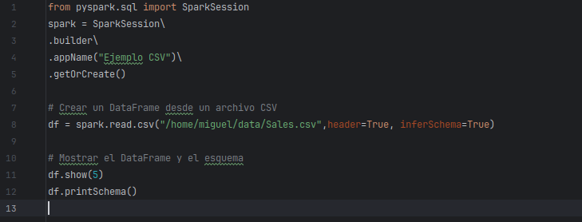

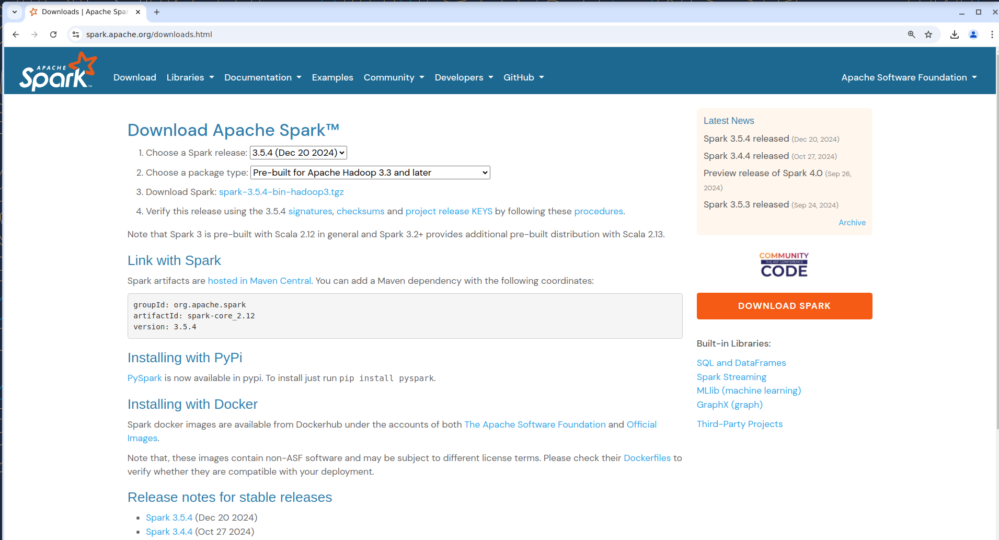

**Crear un DataFrame desde un archivo parquet**

```
from pyspark.sql import SparkSession

spark = SparkSession\\

.builder\\

.appName("Ejemplo CSV")\\

.getOrCreate()

\# Crear un DataFrame desde un archivo CSV

df = spark.read.parquet("/home/miguel/data/house-price.parquet")

\# Mostrar el DataFrame y el esquema

df.show(10)

df.printSchema()
```

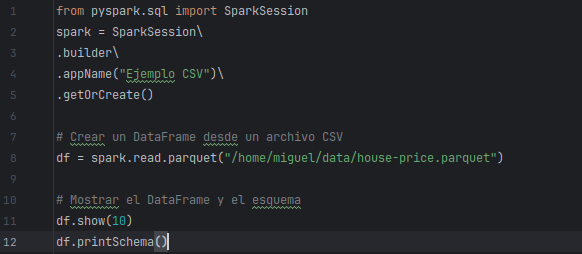

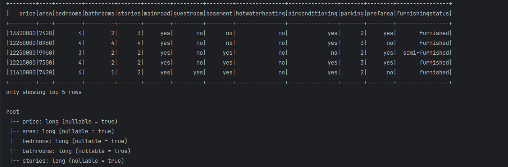

**DataFrame desde un archivo JSON**

```
from pyspark.sql import SparkSession

\# Crear una SparkSession

spark = SparkSession\\

.builder\\

.appName("Ejemplo dataframe con JSON")\\

.getOrCreate()

\# Cargar el DataFrame desde un archivo JSON

df = spark.read.json("/home/miguel/data/users.json", multiLine=True)

\# Consultar el esquema del DataFrame

df.printSchema()

\# Mostrar los primeros 10 registros del DataFrame

df.show(10)
```

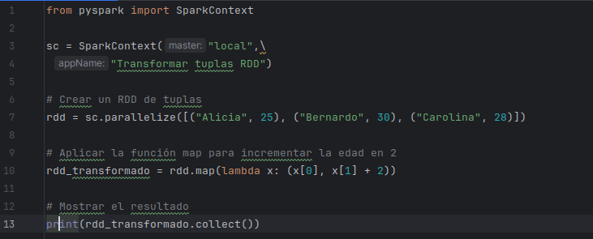

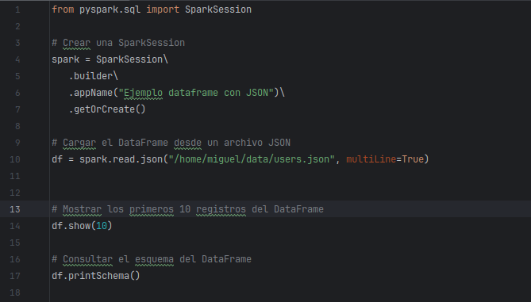


### Tarea 2. Trabajando con DataFrames

Los DataFrames permiten realizar operaciones similares a las de SQL,
como seleccionar columnas, filtrar filas, agrupar datos, etc.

**Seleccionar columnas desde colección**

```
from pyspark.sql import SparkSession

from pyspark.sql.functions import col

spark = SparkSession\\

.builder\\

.appName("Selecion de columnas DataFrame")\\

.getOrCreate()

\# Datos de ejemplo

data = \[

(1, "Alicia", 48, 10000),

(2, "Bernardo", 27, 20000),

(3, "Cesar", 32, 300000)

\]

columns = \["id", "nombre", "edad", "salario"\]

\# Crear DataFrame

df = spark.createDataFrame(data, columns)

\# Mostrar el DataFrame

df.show()

**En este ejemplo:**

-   **pyspark.sql.functions import col** habilita el acceso al objeto
    columna (col) en un DataSet

-   **columns = \["id", "nombre", "edad", "salario"\]** declara las
    columnas que tendrá el DataFrame

-   **createDataFrame(data, columns)** crea el DataFrame a partir de la
    colección de datos y la declaración de columnas.
```

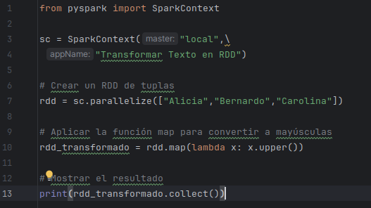

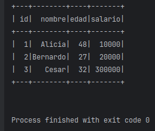

**Seleccionar columnas con select()**

```
from pyspark.sql import SparkSession

from pyspark.sql.functions import col

spark = SparkSession\\

.builder\\

.appName("Selecion de columnas DataFrame")\\

.getOrCreate()

\# Crear DataFrame

df = spark.read.csv("/home/miguel/data/Model/Products.csv",
inferSchema=True, header=True)

df.printSchema()

\# Mostrar el DataFrame

df.select("Product","Cost","Price").show(10)
```


**Seleccionar columnas con la función col()**

```
from pyspark.sql import SparkSession

from pyspark.sql.functions import col

spark = SparkSession\\

.builder\\

.appName("Selecion de columnas DataFrame")\\

.getOrCreate()

\# Crear DataFrame

df = spark.read.csv("/home/miguel/data/Model/Products.csv",
inferSchema=True, header=True)

df.printSchema()

\# Mostrar el DataFrame

df.select(col("Product"),col("Cost"),col("Price")).show(10)
```

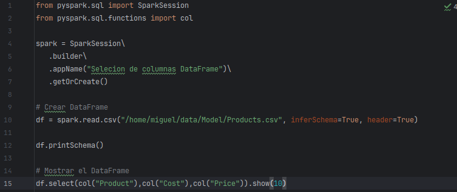

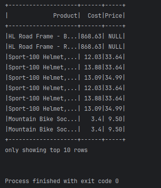

**Renombrar columnas**

Con el objeto **col(),** es posible cambiar el nombre de las columnas
recuperadas con su atributo **alias()**.

```
**from pyspark.sql import SparkSession**

**from pyspark.sql.functions import col**

**spark = SparkSession\\**

**.builder\\**

**.appName("Selecion de columnas DataFrame")\\**

**.getOrCreate()**

**\# Crear DataFrame**

**df = spark.read.csv("/home/miguel/data/Sales.csv", inferSchema=True,
header=True)**

**\# Mostrar el DataFrame**

**df.select(col("SalesOrderNumber").alias("Order"),col("Product").alias("Producto")
,col("Quantity").alias("Cantidad"),col("Sales").alias("Importe")).show(10)**
```

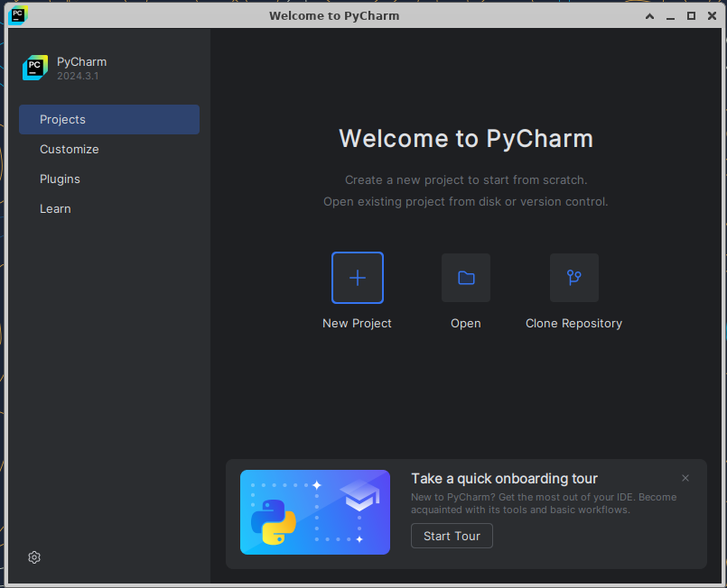

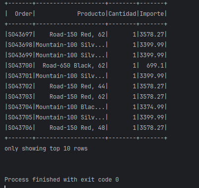

**Agregar columnas literales a un DataFrame existente**

Para adicionar una columna con valor fijo, la función **lit()** permite
asignar un valor constante a una nueva columna.

```
from pyspark.sql import SparkSession

from pyspark.sql.functions import col, lit

spark = SparkSession\\

.builder\\

.appName("Calculo de columnas DataFrame")\\

.getOrCreate()

\# Crear DataFrame

df = spark.read.json("/home/miguel/data/users.json", multiLine=True)

\# Adicinar la coluna Status con un valor fijo

df_empleados = df.withColumn("Status",lit("Active"))

#Mostrar el DataFrame

df_empleados.show()
```

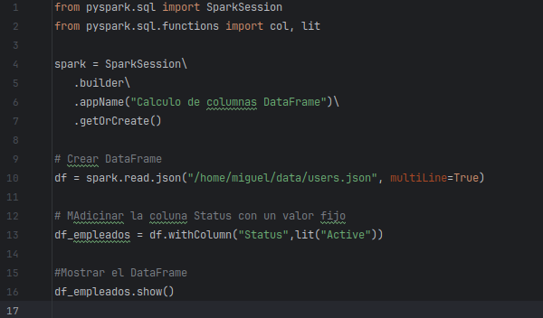

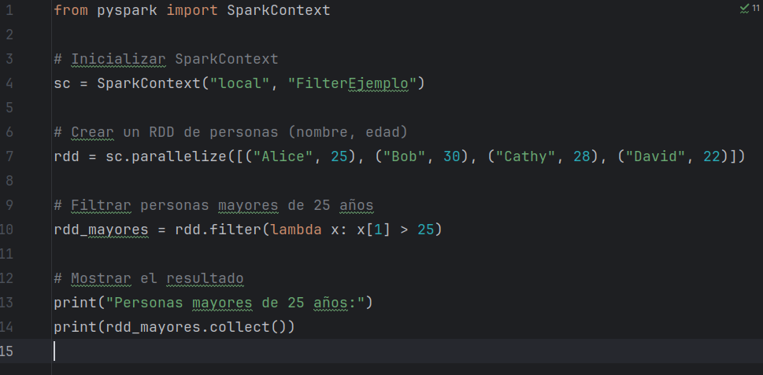

La función lit no se limita a valores simples como enteros o cadenas.

Se pueden manejar expresiones más complejas, como cálculos matemáticos o
concatenación de múltiples columnas.

**Agregar colunas calculadas**

Una forma de adicionar columnas calculadas es a través de la función
expr(). El cálculo se puede basar en el nombre de la columna original o
en el alias.

```
from pyspark.sql import SparkSession

from pyspark.sql.functions import col

from pyspark.sql.functions import expr

spark = SparkSession\\

.builder\\

.appName("Selecion de columnas DataFrame")\\

.getOrCreate()

\# Crear DataFrame

df = spark.read.csv("/home/miguel/data/Sales.csv", inferSchema=True,
header=True)

\# Mostrar el DataFrame

df.select(col("SalesOrderNumber").alias("Order"),col("Product").alias("Producto")

,col("Quantity").alias("Cantidad"),col("Sales").alias("Importe"),

expr("Sales \* Quantity").alias("Subtotal")).show(10)
```

**En este ejemplo:**

-   **from pyspark.sql.functions import expr** importa la función exp(),
    que permite definir una expresión como valor de la columna

-   **expr("Sales \* Quantity").alias("Subtotal")** crea la nueva
    columna.

**Agregar columnas calculadas a un DataFrame existente**

La función **withColumn()** devuelve un nuevo DataFrame agregando una
columna o reemplazando la columna existente que tiene el mismo nombre

```
from pyspark.sql import SparkSession

from pyspark.sql.functions import col

from pyspark.sql.functions import expr

spark = SparkSession\\

.builder\\

.appName("Selecion de columnas DataFrame")\\

.getOrCreate()

\# Crear DataFrame

df = spark.read.csv("/home/miguel/data/Sales.csv", inferSchema=True,
header=True)

\# Mostrar el DataFrame

df_productos =
df.select(col("SalesOrderNumber").alias("Order"),col("Product").alias("Producto")

,col("Quantity").alias("Cantidad"),col("Sales").alias("Importe"))

df_productos = df_productos.withColumn("Total", df_productos.Cantidad \*
df_productos.Importe)

df_productos.show(3)
```

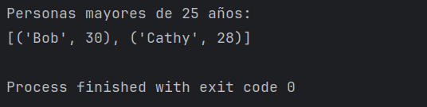

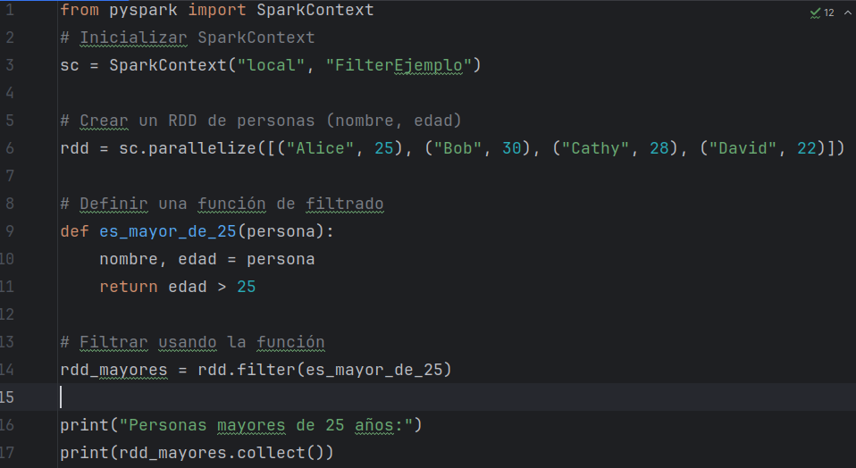

Adicionar varias columnas a un DataFrame existente.

La función **withColumns()** permite adicionar varias columnas a un
DataFrame existente.

```
from pyspark.sql import SparkSession

from pyspark.sql.functions import col

from pyspark.sql.functions import expr

spark = SparkSession\\

.builder\\

.appName("Calculo de columnas DataFrame")\\

.getOrCreate()

\# Crear DataFrame

df = spark.read.csv("/home/miguel/data/Sales.csv", inferSchema=True,
header=True)

\# Mostrar el DataFrame

df_productos =
df.select(col("SalesOrderNumber").alias("Order"),col("Product").alias("Producto")

,col("Quantity").alias("Cantidad"),col("Sales").alias("Importe"))

df_productos = df_productos.withColumns({"Total": df_productos.Cantidad
\* df_productos.Importe,

"Impuesto": df_productos.Importe\*.16})

df_productos.show(3)
```

**En este ejemplo:**

-   Nótese que, para indicar que se va a adicionar una colección de
    columnas, estas aparecen con **{}** en la función **withColumns()**

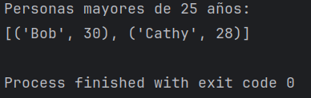

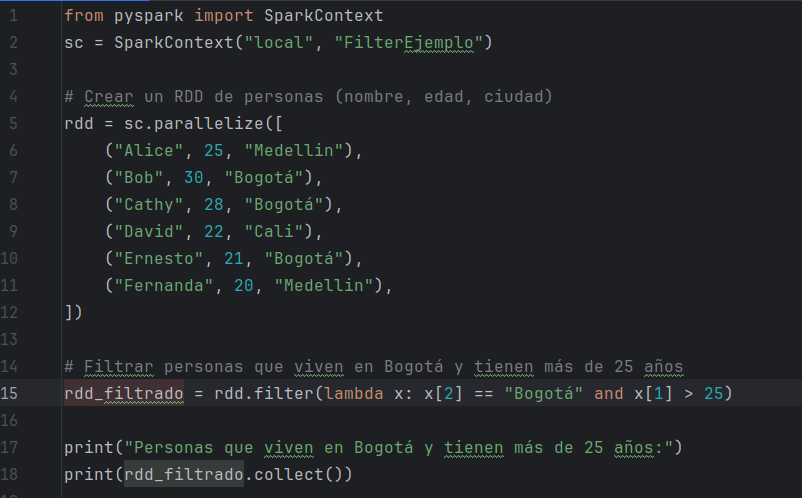

**Salvar DataFrames en archivos**

Se pueden salvar DataFrames en diferentes formatos de archivo: CSV,
Parquet y JSON. Cada uno de estos formatos tiene sus ventajas y usos
específicos.

**Salvar en archivo csv**
```
from pyspark.sql import SparkSession

from pyspark.sql.functions import col

from pyspark.sql.functions import expr

spark = SparkSession\\

.builder\\

.appName("Salvar DataFrame csv")\\

.getOrCreate()

\# Crear DataFrame

df = spark.read.csv("/home/miguel/data/Sales.csv", inferSchema=True,
header=True)

\# Mostrar el DataFrame

df_productos =
df.select(col("SalesOrderNumber").alias("Order"),col("Product").alias("Producto")

,col("Quantity").alias("Cantidad"),col("Sales").alias("Importe"))

df_productos = df_productos.withColumns({"Total": df_productos.Cantidad
\* df_productos.Importe,

"Impuesto": df_productos.Importe\*.16})

df_productos.show(3)

\# Guardar el DataFrame en un archivo CSV

df_productos.write.csv("/home/miguel/data/salida/reporte1.csv",
header=True, mode="overwrite")
```

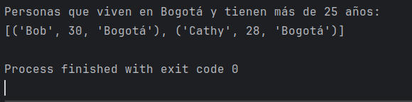

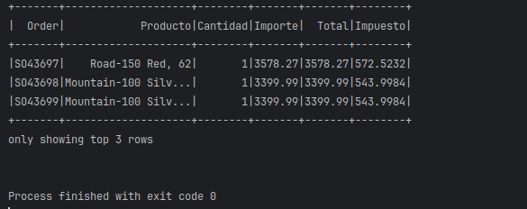

El parámetro **mode** controla el comportamiento si el archivo ya
existe. Los valores comunes son **overwrite** (sobrescribir el archivo
existente), **append** (agregar al archivo existente), **ignore** (no
guardar si el archivo ya existe) y **error** (lanzar un error si el
archivo ya existe).

**Salvar el archivo como parquet**
```
from pyspark.sql import SparkSession

from pyspark.sql.functions import col

from pyspark.sql.functions import expr

spark = SparkSession\\

.builder\\

.appName("Salvar DataFrame csv")\\

.getOrCreate()

\# Crear DataFrame

df = spark.read.csv("/home/miguel/data/Sales.csv", inferSchema=True,
header=True)

\# Mostrar el DataFrame

df_productos =
df.select(col("SalesOrderNumber").alias("Order"),col("Product").alias("Producto")

,col("Quantity").alias("Cantidad"),col("Sales").alias("Importe"))

df_productos = df_productos.withColumns({"Total": df_productos.Cantidad
\* df_productos.Importe,

"Impuesto": df_productos.Importe\*.16})

df_productos.show(3)

\# Guardar el DataFrame en un archivo Parquet

df_productos.write.parquet("/home/miguel/data/salida/reporte2.parquet",
mode="overwrite")
```

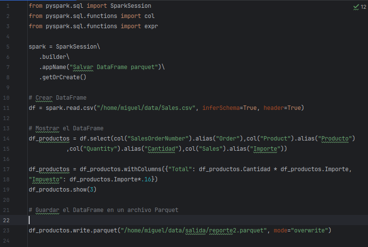

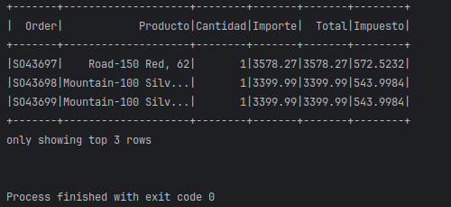

Al mostrar el contenido del directorio, se muestran archivos por
partición. Este es el comportamiento por omisión.

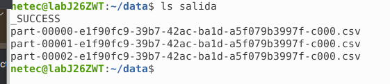

¿Cómo reducir a un solo archivo y cambiar la salida del archivo salvado?

Hay que reducir las particiones antes de salvar el archivo. Esto se
logra con la función `coalesce()`.

```
from pyspark.sql import SparkSession

from pyspark.sql.functions import col

from pyspark.sql.functions import expr

import os

spark = SparkSession\\

.builder\\

.appName("Salvar DataFrame csv")\\

.getOrCreate()

\# Crear DataFrame

df = spark.read.csv("/home/miguel/data/Sales.csv", inferSchema=True,
header=True)

\# Mostrar el DataFrame

df_productos =
df.select(col("SalesOrderNumber").alias("Order"),col("Product").alias("Producto")

,col("Quantity").alias("Cantidad"),col("Sales").alias("Importe"))

df_productos = df_productos.withColumns({"Total": df_productos.Cantidad
\* df_productos.Importe,

"Impuesto": df_productos.Importe\*.16})

df_productos.show(3)

dfx = df_productos.withColumnRenamed("Impuesto","Tax")

dfx.printSchema()

dfx.show(10)

[df_productos =df_productos.coalesce(1)]{.mark}

\# Guardar el DataFrame en un archivo CSV

df_productos.write.csv("/home/netec/data/salida", header=True,
mode="overwrite")

\# Renombrar el archivo

archivos = os.listdir("/home/miguel/data/salida/")

archivo_csv = \[f for f in archivos if f.endswith(".csv")\]\[0\]

os.rename(f"/home/netec/data/salida/{archivo_csv}",
"/home/netec/data/salida/reporte.csv")
```


