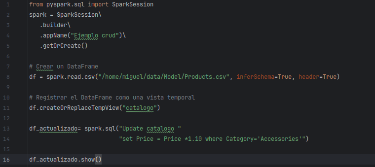
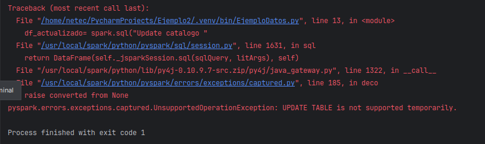
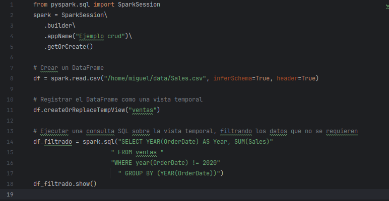
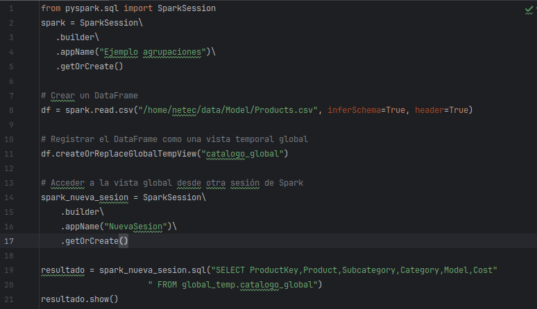
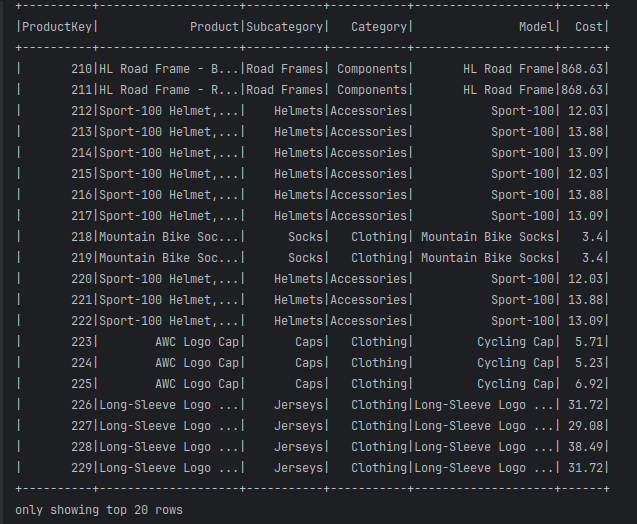

# Laboratorio 4: Trabajando con DataFrames 

**Objetivo:**

Tiempo estimado: 60 minutos

**Prerequisitos:**

-   Acceso a ambiente Linux (credenciales provistas en el curso) o Linux
    local con interfaz gráfica

-   Tener los archivos de datos

-   Completar el laboratorio 1

**Contexto:**

En PySpark, se pueden ejecutar consultas SQL directamente sobre
DataFrames utilizando el módulo sql. Esto es especialmente útil si ya se
está familiarizado con SQL o si se prefiere trabajar con consultas SQL
en lugar de usar las API de PySpark.

**Instrucciones:**

Tarea1: Crear DataFrame desde fuentes de datos y crear vistas temporales

Registrar un DataFrame como una vista temporal en PySpark es una
operación común que permite realizar consultas SQL sobre los datos del
DataFrame. Esto es útil porque combina la flexibilidad de SQL con la
potencia de las operaciones de DataFrame en PySpark.

**¿Qué es una Vista Temporal?**

Una vista temporal es una representación de un DataFrame que puede ser
consultada usando SQL. Al registrar un DataFrame como una vista
temporal, se pueden ejecutar consultas SQL directamente sobre él, sin
necesidad de convertirlo a otro formato.

-   **Vista temporal local:** Solo está disponible en la sesión de Spark
    actual.

-   **Vista temporal global:** Está disponible en todas las sesiones de
    Spark.

**Creación de DataFrame con una colección local**

**from pyspark.sql import SparkSession**

**spark = SparkSession.builder \\ .appName("SQL ejemplo") \\
.getOrCreate()**

\# Datos de ejemplo

data = \[

("Alicia", 38, 50000, "HR"),

("Bertha", 30, 60000, "IT"),

("Carlos", 48, 70000, "Finance"),

("David", 36, 80000, "HR"),

("Eva", 42, 90000, "IT")

> **\]**

**columnas = \["name", "age", "salary", "department"\]**

**\# Crear DataFrame df = spark.createDataFrame(data, columnas)**

\# Mostrar el DataFrame

df.show()

**\# Registrar el DataFrame como una vista temporal**

**df.createOrReplaceTempView("employees")**

**\# Consulta SQL para seleccionar todas las columnas result =
spark.sql("SELECT \* FROM employees") result.show()**

{width="4.51915135608049in"
height="4.04412510936133in"}

{width="2.0321784776902887in"
height="3.06163823272091in"}

Ventajas de usar vistas con DataFrames:

-   **Flexibilidad**: Puedes usar SQL para consultar los datos, lo que
    es especialmente útil si ya estás familiarizado con SQL.

-   **Reutilización**: Una vez que el DataFrame está registrado como una
    vista, puedes ejecutar múltiples consultas SQL sobre él sin
    necesidad de volver a definirlo.

Crear DataFrame desde archivos

from pyspark.sql import SparkSession

spark = SparkSession\\

.builder\\

.appName("Ejemplo vista temporal")\\

.getOrCreate()

**\# Crear un DataFrame desde un csv**

**df = spark.read.csv("/home/miguel/data/Sales.csv", inferSchema=True,
header=True)**

**\# Registrar el DataFrame como una vista temporal
df.createOrReplaceTempView("ventas")**

**\# Ejecutar una consulta SQL sobre la vista temporal**

**resultado = spark.sql("SELECT SalesOrderNumber,
OrderDate,Country,Sales FROM ventas where country= 'Canada'")**

**resultado.show()**

{width="6.1375in" height="2.422222222222222in"}

{width="2.5045898950131233in"
height="3.3877865266841645in"}

**Agregaciones y filtros con SQL**

Se pueden utilizar expresiones de condición similar a las usadas en SQL.
En este ejemplo se usará BETWEEN, AND y OR en la sentencia WHERE:

from pyspark.sql import SparkSession

spark = SparkSession\\

.builder\\

.appName("Ejemplo vista temporal")\\

.getOrCreate()

\# Crear un DataFrame

df = spark.read.csv("/home/miguel/data/Sales.csv", inferSchema=True,
header=True)

\# Registrar el DataFrame como una vista temporal

df.createOrReplaceTempView("ventas")

\# Ejecutar una consulta SQL sobre la vista temporal

resultado = spark.sql("SELECT SalesOrderNumber, OrderDate,Country,"

"Sales FROM ventas where (country= 'Canada' OR country='Germany') AND "

"Sales BETWEEN 3000 and 4000")

resultado.show()

{width="4.805311679790027in"
height="2.2243186789151355in"}

{width="2.352840113735783in"
height="2.6773698600174978in"}

Para agrupar y obtener totales, se usa la sentencia GROUP BY
complementando a la función de agregación. Complementamos el ejemplo
aplicando ordenamiento ascendente por total:

from pyspark.sql import SparkSession

spark = SparkSession\\

.builder\\

.appName("Ejemplo agrupaciones")\\

.getOrCreate()

\# Crear un DataFrame

df = spark.read.csv("/home/miguel/data/Sales.csv", inferSchema=True,
header=True)

\# Registrar el DataFrame como una vista temporal

df.createOrReplaceTempView("ventas")

\# Ejecutar una consulta SQL sobre la vista temporal

resultado = spark.sql("SELECT Country, COUNT(Sales) as NoOperaciones,
SUM(Sales) as Total"

" FROM ventas "

"GROUP BY (Country) Order BY Total")

resultado.show()

{width="5.084622703412074in"
height="2.3225415573053367in"}

{width="2.935148731408574in"
height="2.0613265529308835in"}

## Tarea 2: Operaciones CRUD con DataFrames

En PySpark, puedes realizar operaciones CRUD (Create, Read, Update,
Delete) tanto utilizando DataFrames como SQL. Para usar SQL en PySpark,
primero debes registrar el DataFrame como una vista temporal.

**Actualizando un DataFrame con SQL**

En SQL, puedes simular una actualización seleccionando y transformando
los datos.

from pyspark.sql import SparkSession

spark = SparkSession\\

.builder\\

.appName("Ejemplo crud")\\

.getOrCreate()

\# Crear un DataFrame

df = spark.read.csv("/home/miguel/data/Model/Products.csv",
inferSchema=True, header=True)

\# Registrar el DataFrame como una vista temporal

df.createOrReplaceTempView("catalogo")

df_actualizado= spark.sql("SELECT ProductKey,Product,Category,Price, "

"CASE WHEN Category = 'Accessories' THEN Price\*1.10 ELSE Price END AS
NewPrice "

"FROM catalogo")

df_actualizado.show()

{width="4.463797025371829in"
height="1.9591622922134733in"}{width="3.401636045494313in"
height="3.2007764654418196in"}

Notemos el resultado de la ejecución del siguiente código, válido en SQL

from pyspark.sql import SparkSession

spark = SparkSession\\

.builder\\

.appName("Ejemplo crud")\\

.getOrCreate()

\# Crear un DataFrame

df = spark.read.csv("/home/miguel/data/Model/Products.csv",
inferSchema=True, header=True)

\# Registrar el DataFrame como una vista temporal

df.createOrReplaceTempView("catalogo")

df_actualizado= spark.sql("Update catalogo "

"set Price = Price \*1.10 where Category='Accessories'")

df_actualizado.show()

{width="4.5018536745406825in"
height="2.0079549431321086in"}

{width="4.645621172353456in"
height="1.3834886264216972in"}

Esto porque, al ser un objeto temporal, no son tablas SQL y
actualizaciones con UPDATE o DELETE no se permiten

**Eliminar filas de un DataFrame: Puedes simular una eliminación
excluyendo filas en una consulta SQL.**

from pyspark.sql import SparkSession

spark = SparkSession\\

.builder\\

.appName("Ejemplo crud")\\

.getOrCreate()

\# Crear un DataFrame

df = spark.read.csv("/home/miguel/data/Sales.csv", inferSchema=True,
header=True)

\# Registrar el DataFrame como una vista temporal

df.createOrReplaceTempView("ventas")

\# Ejecutar una consulta SQL sobre la vista temporal, filtrando los
datos que no se requieren

df_filtrado = spark.sql("SELECT YEAR(OrderDate) AS Year, SUM(Sales)"

" FROM ventas "

"WHERE year(OrderDate) != 2020"

" GROUP BY (YEAR(OrderDate))")

df_filtrado.show()

{width="4.563931539807524in"
height="2.364589895013123in"}

{width="2.4870133420822396in"
height="1.6173228346456694in"}

## Tarea 3: Uso de vistas temporales globales

Si necesitas que una vista temporal esté disponible en todas las
sesiones de Spark, puedes registrarla como una vista global con la
función **createOrReplaceGlobalTempView** .

from pyspark.sql import SparkSession

spark = SparkSession\\

.builder\\

.appName("Ejemplo agrupaciones")\\

.getOrCreate()

\# Crear un DataFrame

df = spark.read.csv("/home/netec/data/Model/Products.csv",
inferSchema=True, header=True)

\# Registrar el DataFrame como una vista temporal global

df.createOrReplaceGlobalTempView("catalogo_global")

\# Acceder a la vista global desde otra sesión de Spark

spark_nueva_sesion = SparkSession\\

.builder\\

.appName("NuevaSesion")\\

.getOrCreate()

resultado = spark_nueva_sesion.sql("SELECT
ProductKey,Product,Subcategory,Category,Model,Cost"

" FROM global_temp.catalogo_global")

resultado.show()

**En este ejemplo:**

-   **NuevaSesion** es la sesión alternativa que se crea para probar el
    objeto global

-   **global_temp** es el espacio de nombres donde se localizan los
    objetos globales disponibles

{width="4.255542432195975in"
height="2.451823053368329in"}

{width="3.8817465004374454in"
height="3.193063210848644in"}

**¿Cuándo no usar vistas temporales?**

-   Si solo necesitas operaciones simples (como filtros o selecciones),
    es más eficiente usar las API de DataFrame directamente.

-   Si trabajas con datos pequeños y no necesitas SQL, registrar una
    vista temporal puede ser innecesario.

Las vistas temporales son una herramienta poderosa en PySpark para
combinar SQL y DataFrames, lo que facilita el análisis de datos en
entornos distribuidos.

\*\*\* Fin del Laboratorio
