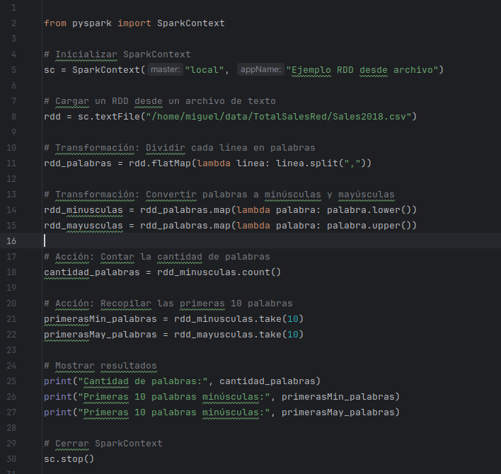
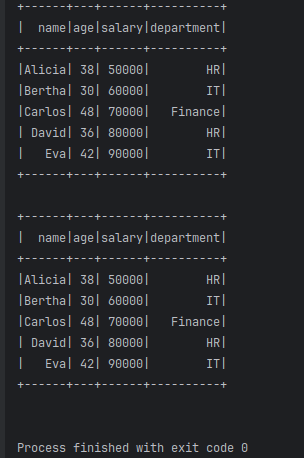
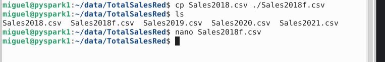
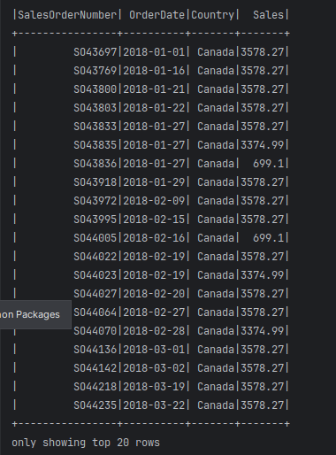
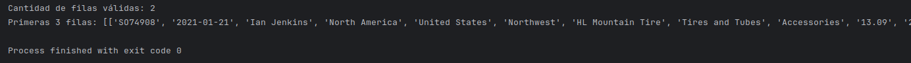
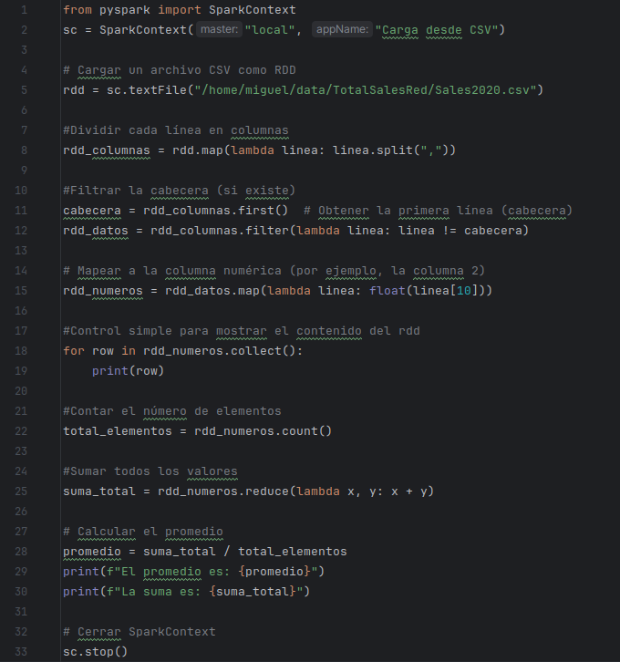
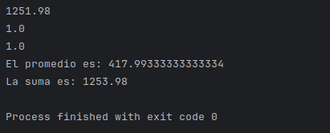
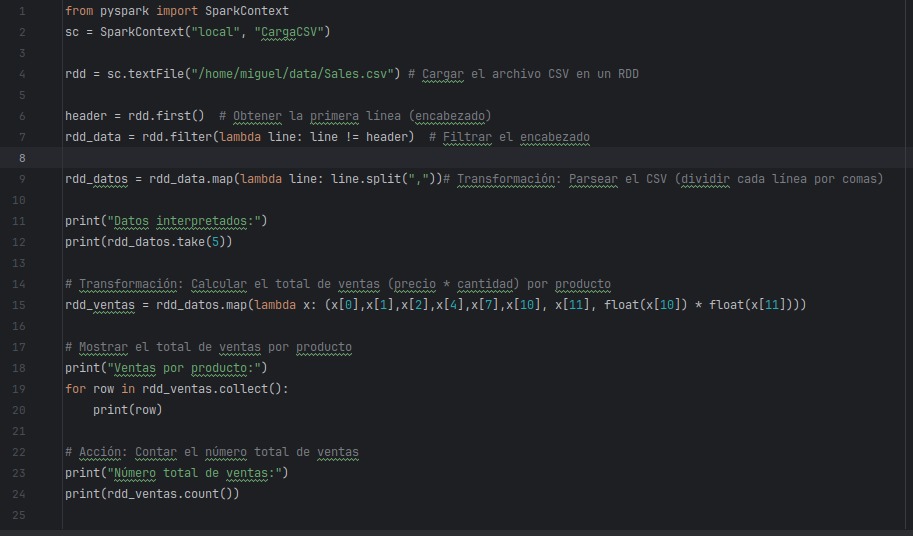
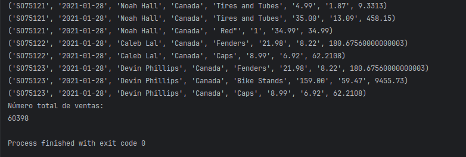

# Laboratorio 4: Acciones sobre RDD

**Objetivo:**

Entender la función de las acciones y aplicarlas sobre RDD

**Tiempo estimado:**

45 minutos

**Prerrequisitos:**

- Acceso a ambiente Linux (credenciales provistas en el curso) o Linux local con interfaz gráfica

- Conexión a internet

**Contexto:**

Las acciones en PySpark son operaciones que disparan la ejecución de las transformaciones acumuladas en un RDD.

Algunas acciones comunes incluyen collect(), count(), first(), take(), reduce(), foreach(), y saveAsTextFile().

Las acciones devuelven resultados al programa driver o escriben datos en un sistema externo. A diferencia de las transformaciones (como map, filter, etc.), que son perezosas (lazy) y no se ejecutan hasta que se llama a una acción, las acciones disparan la ejecución de todas las transformaciones acumuladas en el RDD.

**Instrucciones:**

## Tarea 1: Aplicar acciones en un archivo

En este ejemplo, se leerá el contenido de un archivo para contar las palabras

Iniciamos PyCharm

pycharm-community

Se introduce el siguiente código, ajustando la ruta del archivo a la ruta local.

**\# Inicializar SparkContext**

**sc = SparkContext("local", "Ejemplo RDD desde archivo")**

**\# Cargar un RDD desde un archivo de texto**

**rdd = sc.textFile("/home/miguel/data/TotalSalesRed/Sales2018.csv")**

**\# Transformación: Dividir cada línea en palabras**

**rdd\_palabras = rdd.flatMap(lambda linea: linea.split(","))**

**\# Transformación: Convertir palabras a minúsculas y mayúsculas**

**rdd\_minusculas = rdd\_palabras.map(lambda palabra: palabra.lower())**

**rdd\_mayusculas = rdd\_palabras.map(lambda palabra: palabra.upper())**

**\# Acción: Contar la cantidad de palabras**

**cantidad\_palabras = rdd\_minusculas.count()**

**\# Acción: Recopilar las primeras 10 palabras**

**primerasMin\_palabras = rdd\_minusculas.take(10)**

**primerasMay\_palabras = rdd\_mayusculas.take(10)**

**\# Mostrar resultados**

**print("Cantidad de palabras:", cantidad\_palabras)**

**print("Primeras 10 palabras minúsculas:", primerasMin\_palabras)**

**print("Primeras 10 palabras minúsculas:", primerasMay\_palabras)**

**\# Cerrar SparkContext**

**sc.stop()**

**Validación de archivos por columnas**

Un uso que se pueden aplicar en archivos CSV, es el contar filas que tienen la cantidad válida de columnas. Para esto, copiaremos y modificaremos uno de los archivos para reducir la cantidad de columnas.

Abrimos una ventana de terminal nueva. En el directorio de data, pasamos al directorio TotalSalesRed

cd data/TotalSalesRed

Copiamos el archivo Sales2018 a Sales2018Redf.csv

cp Sales2018.csv Sales2018f.csv

Con cualquier editor, se abre el archivo y removemos campos en diferentes renglones para tener filas de menos de 5 campos. Recordemos que los campos están separados por comas (,)

Salvamos el archivo y regresamos a PyCharm (Ctrl+O para salvar y CTRL+X para salir)

Probamos el siguiente código:

from pyspark import SparkContext

sc = SparkContext("local", "Ejemplo RDD desde CSV")

\# Cargar un RDD desde un archivo de texto

rdd = sc.textFile("/home/miguel/data/TotalSalesRed/Sales2018f.csv")

\# Transformación: Dividir cada línea en columnas

rdd\_columnas = rdd.map(lambda linea: linea.split(","))

\# Transformación: Filtrar filas que tienen más de 2 columnas

rdd\_filtrado = rdd\_columnas.filter(lambda columnas: len(columnas) &gt; 6)

\# Acción: Contar el número de filas válidas

cantidad\_filas = rdd\_filtrado.count()

\# Acción: Recopilar las primeras 3 filas

primeras\_filas = rdd\_filtrado.take(3)

\# Mostrar resultados

print("Cantidad de filas válidas:", cantidad\_filas)

print("Primeras 3 filas:", primeras\_filas)

\# Cerrar SparkContext

sc.stop()

**Extraer y calcular valores desde un csv**

Se pueden realizar diferentes operaciones con los valores leídos del rdd

from pyspark import SparkContext

sc = SparkContext("local", "Carga desde CSV")

\# Cargar un archivo CSV como RDD

rdd = sc.textFile("/home/miguel/data/TotalSalesRed/Sales2020.csv")

\#Dividir cada línea en columnas

rdd\_columnas = rdd.map(lambda linea: linea.split(","))

\#Filtrar la cabecera (si existe)

cabecera = rdd\_columnas.first() \# Obtener la primera línea (cabecera)

rdd\_datos = rdd\_columnas.filter(lambda linea: linea != cabecera)

\# Mapear a la columna numérica (por ejemplo, la columna 2)

rdd\_numeros = rdd\_datos.map(lambda linea: float(linea\[10\]))

\#Control simple para mostrar el contenido del rdd

for row in rdd\_numeros.collect():

print(row)

\#Contar el número de elementos

total\_elementos = rdd\_numeros.count()

\#Sumar todos los valores

suma\_total = rdd\_numeros.reduce(lambda x, y: x + y)

\# Calcular el promedio

promedio = suma\_total / total\_elementos

print(f"El promedio es: {promedio}")

print(f"La suma es: {suma\_total}")

\# Cerrar SparkContext

sc.stop()

**Obtener el pedido, fecha cliente, país, cantidad de producto, precio. Calcular importe y total de ventas**

from pyspark import SparkContext

sc = SparkContext("local", "CargaCSV")

rdd = sc.textFile("/home/miguel/data/Sales.csv") \# Cargar el archivo CSV en un RDD

header = rdd.first() \# Obtener la primera línea (encabezado)

rdd\_data = rdd.filter(lambda line: line != header) \# Filtrar el encabezado

rdd\_datos = rdd\_data.map(lambda line: line.split(","))# Transformación: Parsear el CSV (dividir cada línea por comas)

print("Datos interpretados:")

print(rdd\_datos.take(5))

\# Transformación: Calcular el total de ventas (precio \* cantidad) por producto

rdd\_ventas = rdd\_datos.map(lambda x: (x\[0\],x\[1\],x\[2\],x\[4\],x\[7\],x\[10\], x\[11\], float(x\[10\]) \* float(x\[11\])))

print("Ventas por producto:") \# Mostrar el total de ventas por producto

for row in rdd\_ventas.collect():

print(row)

print("Número total de ventas:") \# Acción: Contar el número total de ventas

print(rdd\_ventas.count())

rdd\_fechas = rdd\_ventas.map(lambda cols: (cols\[1\], 1)) \# Transformación: Mapear a pares (fecha, 1)

rdd\_ventas\_por\_dia = rdd\_fechas.reduceByKey(lambda x, y: x + y) \# Transformación: Contar número ventas por fecha

for fecha, ventas in rdd\_ventas\_por\_dia.collect(): \# Acción: Recopilar y mostrar las ventas por día

print(f"Fecha: {fecha}, Ventas: {ventas}")

**sc.stop()**

\*\*\* Fin del laboratorio
