# Práctica 5. Aplicando aspectos avanzados

**Objetivo de la práctica:**

Al finalizar la práctica serás capaz de:
- Aplicar técnicas avanzadas a conjuntos de datos, como shuffling, accumulators, partitioning y brodcast de variables.

**Tiempo aproximado:**
- 60 minutos.

**Prerequisitos:**

- Acceso al ambiente Linux (credenciales provistas en el curso) o Linux local con interfaz gráfica.
- Tener los archivos de datos.
- Completar el laboratorio 1.

**Contexto:**

- La optimización de operaciones con RDDs en PySpark es crucial para mejorar el rendimiento de las aplicaciones, especialmente cuando se trabajan con grandes volúmenes de datos.

- El particionamiento es la forma en que los datos se dividen y distribuyen en el clúster. Un buen particionamiento puede mejorar el rendimiento al permitir un paralelismo eficiente y minimizar el shuffling.

**Instrucciones:**

## Tarea 1: Crear y ajustar el número de particiones:

**Crear un RDD con un número específico de particiones**

```
from pyspark import SparkContext

# Inicializar SparkContext
sc = SparkContext("local", "Particionamiento")

# Crear un RDD con 4 particiones
rdd = sc.parallelize(range(10), 4)

# Ver el número de particiones
print("Número de particiones:", rdd.getNumPartitions())

# Mostrar el contenido de cada partición
print(rdd.glom().collect())

# Cerrar SparkContext
sc.stop()
```

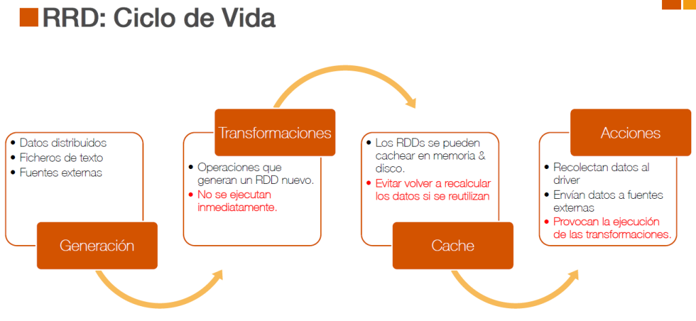

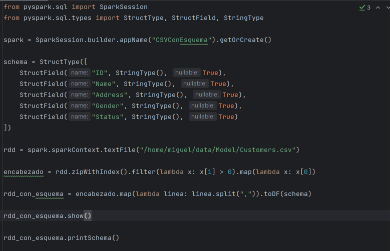

En este ejemplo:

-   **sc.parallelize(range(10), 4)** crea un RDD con 10 elementos divididos en 4 particiones.

-   **glom()** muestra el contenido de cada partición.

**Cargar un archivo csv con 4 particiones**

```
from pyspark import SparkContext

sc = SparkContext("local", "Cargar CSV con 4 particiones")
ruta_csv = "/home/miguel/data/Model/Products.csv"

# Cargar el archivo CSV en un RDD con 4 particiones
rdd = sc.textFile(ruta_csv, minPartitions=4)

# Verificar el número de particiones
print("Número de particiones:", rdd.getNumPartitions()) # Debería ser 4

# Transformación: Dividir cada línea en columnas
rdd_columnas = rdd.map(lambda linea: linea.split(","))

# Filtrar la cabecera (si existe)
cabecera = rdd_columnas.first() # Obtener la primera línea (cabecera)
rdd_datos = rdd_columnas.filter(lambda linea: linea != cabecera) # Filtrar la cabecera

# Ver el contenido de cada partición
print("Contenido de las particiones:")
particiones = rdd_datos.glom().collect()
for i, particion in enumerate(particiones):
    print(f"Partición {i}: {particion}")

# Cerrar SparkContext
sc.stop()
```

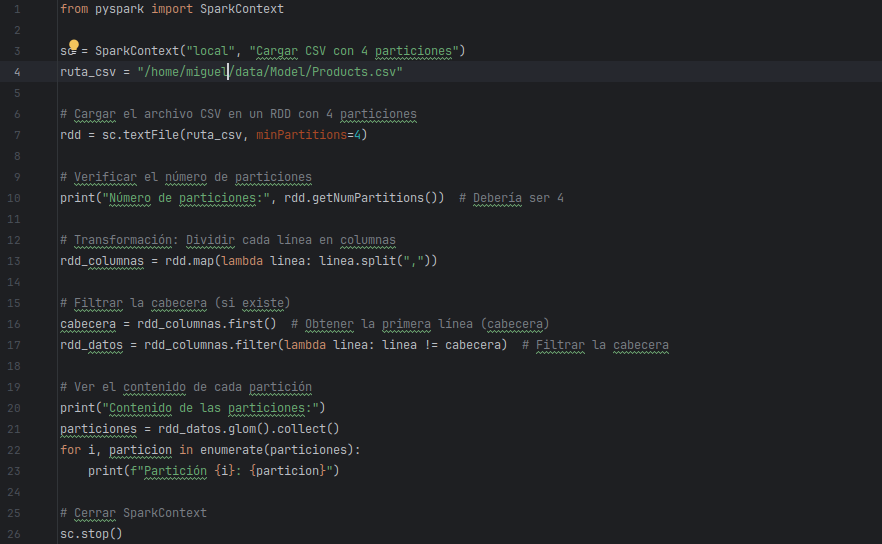


En este ejemplo:

-   **sc.textFile(ruta\_csv, minPartitions=4)** para cargar el archivo CSV en un RDD con al menos 4 particiones.
-   **getNumPartitions()** para verificar RDD el número de particiones.
-   **glom()** para mostrar el contenido de cada partición.

**Nota: El número real de particiones puede ser mayor que 4 si el archivo es grande, ya que minPartitions es un mínimo, no un máximo.**

## Tarea 2: Reparticionamiento

El reparticionamiento permite ajustar el número de particiones de un RDD. Esto es útil para optimizar el paralelismo o reducir la sobrecarga.

Para reparticionar, se pueden usar **repartition()** o **coalesce()**

-   **repartition():** Aumenta o reduce el número de particiones, pero siempre causa shuffling.
-   **coalesce():** Reduce el número de particiones sin shuffling (más eficiente que repartition).

```
from pyspark import SparkContext
sc = SparkContext("local\[4\]", "Particionamiento")

rdd = sc.textFile("/home/miguel/data/Model/Customers.csv") # Cargar el archivo CSV en un RDD

# Mostrar el número de particiones
print(rdd.getNumPartitions())

# Reparticionar el RDD
rdd_reparticionado1 = rdd.repartition(10) # Esto provocaría shuffling
rdd_reparticionado2 = rdd.coalesce(10) # No provoca shuffling

print(rdd_reparticionado1.getNumPartitions())
# Mostrar el contenido de cada partición
print(rdd_reparticionado1.glom().collect())

print(rdd_reparticionado2.getNumPartitions())
print(rdd_reparticionado1.glom().collect())

# Cerrar SparkContext
sc.stop()
```

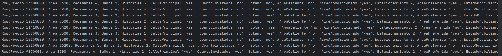

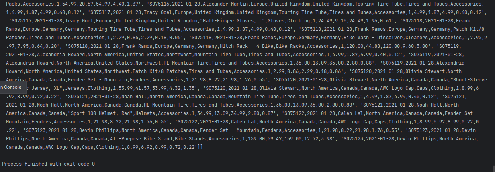

En este ejemplo:

-   **repartition(10)** ajusta el número de particiones a 10, pero causa shuffling.

-   **coalesce(10)** ajusta el número de particiones a 10 sin shuffling.

## Tarea 3: Optimización con Particionamiento y Persistencia

El control de operaciones implica gestionar cómo se ejecutan las transformaciones y acciones en el clúster.

-   **Persistencia de RDDs:** Usa persist() o cache() para evitar recalcular RDDs que se usan varias veces.

-   **Control del orden de ejecución:** Las transformaciones son perezosas (lazy), pero puedes forzar la ejecución con acciones como count() o collect().

```
from pyspark import SparkContext, StorageLevel

# Inicializar SparkContext
sc = SparkContext("local", "Optimización con Particionamiento")

# Cargar datos de ventas
rdd = sc.textFile("/home/miguel/data/Sales.csv")

# Eliminar cabecera
cabecera = rdd.first()
rdd_datos = rdd.filter(lambda linea: linea != cabecera)

# Transformación: Mapear a (producto, cantidad)
rdd_productos = rdd_datos.map(lambda linea: (linea.split(",")[6], float(linea.split(",")[10])))

# Reparticionar por clave (producto)
rdd_reparticionado = rdd_productos.partitionBy(4)

# Persistir el RDD para reutilización
rdd_reparticionado.persist(StorageLevel.MEMORY_AND_DISK)

# Reducción: Calcular total por producto
rdd_total = rdd_reparticionado.reduceByKey(lambda x, y: x + y)

# Acción: Recopilar resultados
resultados = rdd_total.collect()

# Mostrar resultados
for producto, total in resultados:
    print(f"{producto}: {total}")

# Liberar persistencia
rdd_reparticionado.unpersist()

# Cerrar SparkContext
sc.stop()
```

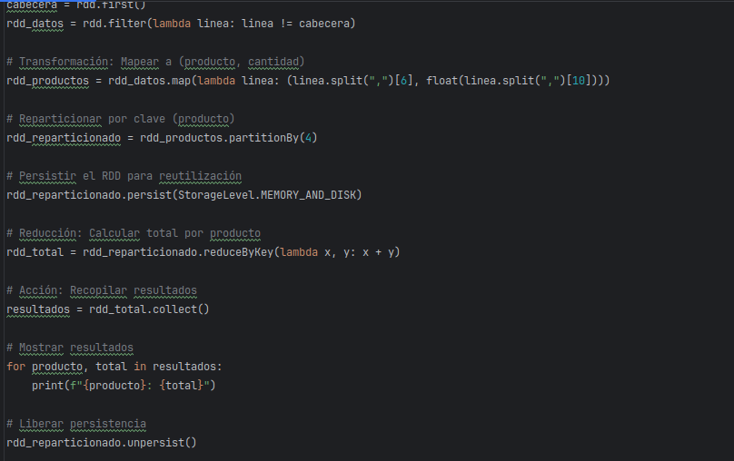


En este ejemplo, optimizaciones aplicadas:

-   **Particionamiento por clave:** Se usa partitionBy para distribuir los datos por producto.

-   **Persistencia:** El RDD se persiste en memoria y disco para evitar recalcularlo.

-   **Reducción local:** reduceByKey realiza una reducción local antes del shuffling.

## Tarea 4: Reconocer el impacto del shuffling

El **shuffling** es un concepto muy importante en PySpark y Spark debido a su impacto significativo en el rendimiento de las aplicaciones distribuidas. El shuffling ocurre cuando los datos necesitan ser redistribuidos entre los nodos del clúster, lo que puede ser una operación costosa en términos de tiempo y recursos.

El shuffling es el proceso de redistribuir los datos entre los nodos del clúster para agruparlos o reorganizarlos según una clave. Esto ocurre en operaciones como:

-   **groupByKey**: Agrupa los valores por clave.

-   **reduceByKey**: Reduce los valores por clave.

-   **join**: Combina dos RDDs basados en una clave.

-   **distinct**: Elimina duplicados.

-   **repartition**: Cambia el número de particiones.

Durante el shuffling, los datos se escriben en disco y se transfieren a través de la red, lo que lo convierte en una operación costosa.

**Se tiene un RDD con pares clave-valor y se quiere agrupar los valores por clave.**

```
from pyspark import SparkContext

# Inicializar SparkContext
sc = SparkContext("local", "Ejemplo de Shuffling")

# Crear un RDD con pares clave-valor
rdd = sc.parallelize([("a", 1), ("b", 2), ("a", 3), ("b", 4)\])

# Operación que causa shuffling: groupByKey
rdd_agrupado = rdd.groupByKey()

# Mostrar los resultados
resultados = rdd_agrupado.collect()
for clave, valores in resultados:
    print(f"{clave}: {list(valores)}")

# Cerrar SparkContext
sc.stop()
```

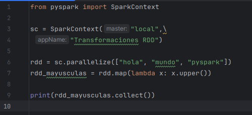


En este ejemplo:

-   **groupByKey** causa shuffling porque necesita agrupar todos los valores con la misma clave en la misma partición.

-   Durante el shuffling, los datos se transfieren entre los nodos del clúster.

## Tarea 5: Minimizar shuffling

Minimizar el shuffling es clave para optimizar el rendimiento en PySpark.

-   **Usar reduceByKey en lugar de groupByKey:** reduceByKey realiza una reducción local antes de hacer el shuffling, lo que reduce la cantidad de datos transferidos.

-   **groupByKey** transfiere todos los datos sin reducción previa.

-   **Evitar operaciones amplias (wide):** Operaciones como cartesian() o distinct() pueden causar mucho shuffling. Úsalas solo cuando sea estrictamente necesario.

-   **Usar particionamiento adecuado:** Un buen particionamiento puede reducir el shuffling al mantener los datos relacionados en la misma partición.

-   **Minimizar el tamaño de los datos:** Reduce el tamaño de los datos antes de operaciones que causen shuffling. Por ejemplo, filtra o proyecta columnas innecesarias.

-   **Usar coalesce en lugar de repartition:** **coalesce** reduce el número de particiones sin shuffling, mientras que **repartition** siempre causa shuffling.

**Ejemplo:**

Se tiene un RDD con registros de ventas y queremos calcular el total de ventas por producto, minimizando el shuffling.

```
from pyspark import SparkContext

sc = SparkContext("local", "CargaCSV")

rdd = sc.textFile("/home/miguel/data/Sales.csv") # Cargar el archivo CSV en un RDD

header = rdd.first() # Obtener la primera línea (encabezado)
rdd_data = rdd.filter(lambda line: line != header) # Filtrar el encabezado

rdd_datos = rdd_data.map(lambda line: line.split(","))# Transformación: Parsear el CSV (dividir cada línea por comas)

# Transformación: Obtener pais e importe
rdd_ventas = rdd_datos.map(lambda x: (x[4], float(x[10]) * float(x[11])))

for producto in rdd_ventas.collect():
    print(producto)

# Reducción: Calcular total por producto (con reducción local)
rdd_total = rdd_ventas.reduceByKey(lambda x, y: x + y)

# Acción: Recopilar resultados
resultados = rdd_total.collect()

# Mostrar resultados
print(" *** Total por país")

for producto, total in resultados:
    print(f"{producto}: {total}")

sc.stop()
```


## 

## Tarea 6: Broadcast de variables

En PySpark, broadcast Variables (variables transmitidas) permite distribuir grandes estructuras de datos de solo lectura a todos los nodos del clúster de manera eficiente. Esto evita el costo de enviar repetidamente la misma información a cada tarea, lo que mejora el rendimiento.

Cuando trabajamos con RDDs en un clúster de Spark, cualquier variable externa utilizada dentro de una función lambda en una transformación (map, filter, etc.) se enviará a cada tarea ejecutada en los trabajadores. Si la variable es grande, esto puede generar un uso excesivo de la red y reducir el rendimiento.

Con broadcast, enviamos la variable una sola vez, y luego todas las tareas acceden a ella desde su caché local, evitando el reenvío repetido.

```
from pyspark import SparkContext

# Inicializar SparkContext

sc = SparkContext("local", "Broadcast Example")

# Diccionario de referencia (código de producto -&gt; nombre)
diccionario_productos = {
    101: "ProductoA",
    102: "ProductoB",
    103: "ProductoC"
}

# Crear la variable broadcast
broadcast_diccionario = sc.broadcast(diccionario_productos)

# RDD de ventas (código de producto, cantidad)
rdd_ventas = sc.parallelize([(101, 2), (102, 3), (103, 1), (101, 5)])

# Transformación: Enriquecer el RDD con los nombres de los productos
rdd_enriquecido = rdd_ventas.map(lambda venta: (venta[0], venta[1], broadcast_diccionario.value[venta[0]]))

# Acción: Recopilar y mostrar los resultados
resultados = rdd_enriquecido.collect()
for resultado in resultados:
    print(resultado) # Salida: (101, 2, 'ProductoA'), (102, 3, 'ProductoB'), etc.

# Liberar la variable broadcast
broadcast_diccionario.unpersist()

# Cerrar SparkContext
sc.stop()

```

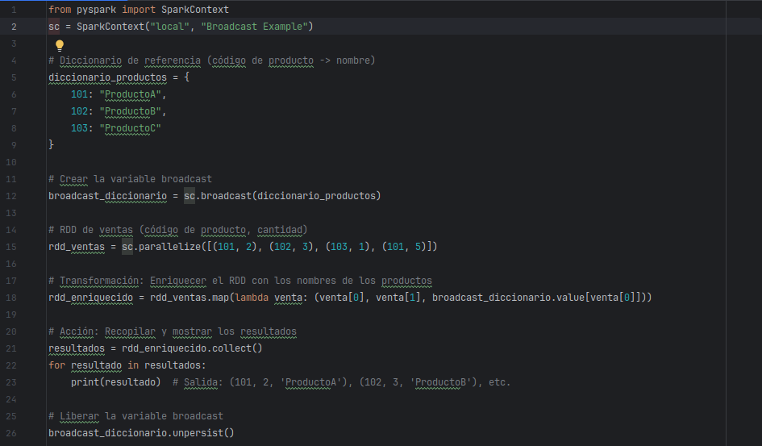

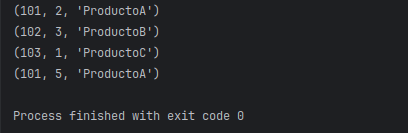

En este ejemplo:

-   **sc.broadcast(diccionario\_productos):** Crea un objeto broadcast con el diccionario.

-   **broadcast\_diccionario.value:** Accede al diccionario en los executors.

-   **map():** Usa el diccionario broadcast para enriquecer el RDD de ventas.

-   **unpersist():** Libera los recursos utilizados por el broadcast.

**Broadcast con una Lista**

Asumamos que se tiene una lista de códigos de productos en oferta y se quiere filtrar un RDD de ventas para incluir solo esos productos.

```
from pyspark import SparkContext

# Inicializar SparkContext
sc = SparkContext("local", "Broadcast Example")

# Lista de productos en oferta
productos_oferta = [101, 103]

# Crear la variable broadcast
broadcast_oferta = sc.broadcast(productos_oferta)

# RDD de ventas (código de producto, cantidad)
rdd_ventas = sc.parallelize([(101, 2), (102, 3), (103, 1), (101, 5)])

# Transformación: Filtrar ventas de productos en oferta
rdd_filtrado = rdd_ventas.filter(lambda venta: venta[0] in broadcast_oferta.value)

# Acción: Recopilar y mostrar los resultados
resultados = rdd_filtrado.collect()
for resultado in resultados:
print(resultado) # Salida: (101, 2), (103, 1), (101, 5)

# Liberar la variable broadcast
broadcast_oferta.unpersist()

# Cerrar SparkContext
sc.stop()

```


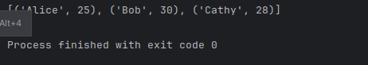

En este ejemplo:

-   **sc.broadcast(productos\_oferta):** Crea un objeto broadcast con la lista de productos en oferta.

-   **broadcast\_oferta.value:** Accede a la lista en los executors.

-   **filter():** Usa la lista broadcast para filtrar el RDD de ventas.

-   **unpersist():** Libera los recursos utilizados por el broadcast.

## Tarea 7: Broadcast con tabla de parámetros

Ahora tenemos una tabla de parámetros que se requiere usar en múltiples operaciones.

```
from pyspark import SparkContext

# Inicializar SparkContext

sc = SparkContext("local", "Broadcast Example")

# Configuración (diccionario de parámetros)
configuracion = {
    "tasa_impuesto": 0.15,
    "descuento": 0.10
}

# Crear la variable broadcast
broadcast_config = sc.broadcast(configuracion)

# RDD de ventas (producto, monto)
rdd_ventas = sc.parallelize([("ProductoA", 100), ("ProductoB", 200), ("ProductoC", 150)])

# Transformación: Calcular el monto total con impuestos y descuentos
rdd_calculado = rdd_ventas.map(lambda venta: (
venta[0],
venta[1],
venta[1] * (1 + broadcast_config.value["tasa_impuesto"]), # Monto con impuesto
venta[1] * (1 - broadcast_config.value["descuento"]) # Monto con descuento
))

# Acción: Recopilar y mostrar los resultados
resultados = rdd_calculado.collect()
for resultado in resultados:
    print(resultado)

# Salida: ('ProductoA', 100, 115.0, 90.0), etc.

# Liberar la variable broadcast
broadcast_config.unpersist()

# Cerrar SparkContext
sc.stop()

```
En este ejemplo:

-   **sc.broadcast(configuracion):** Crea un objeto broadcast con la configuración.

-   **broadcast\_config.value:** Accede a la configuración en los executors.

-   **map():** Usa la configuración broadcast para calcular montos con impuestos y descuentos.

-   **unpersist():** Libera los recursos utilizados por el broadcast.

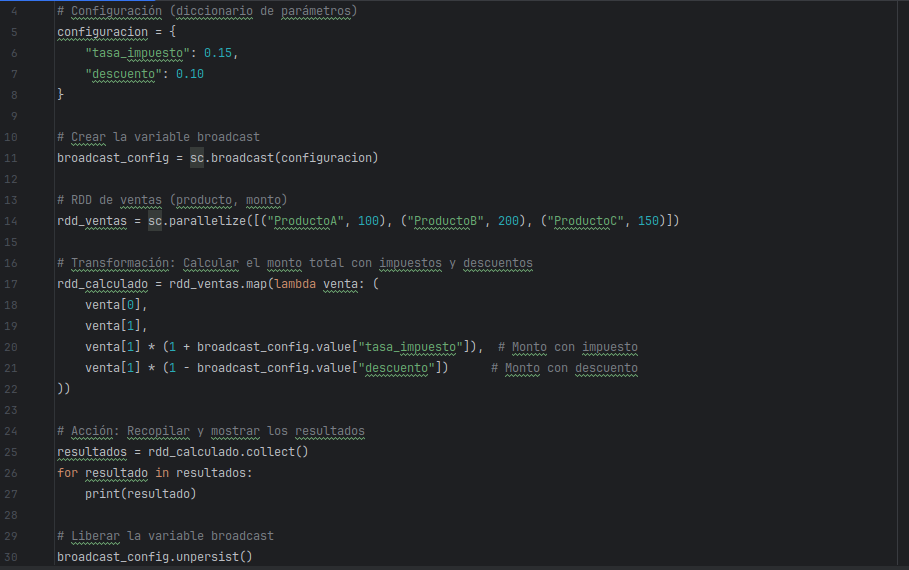

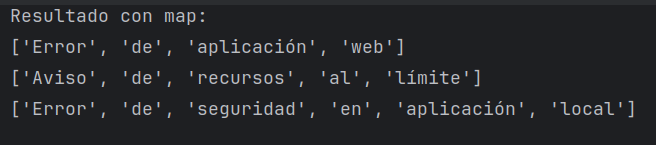

## 

## Tarea 8: Usando de acumuladores

Los acumuladores en PySpark son variables compartidas que permiten sumar valores de manera eficiente en un clúster distribuido. Son útiles cuando necesitamos contar eventos, sumar valores o rastrear estadísticas sin comunicación constante entre los nodos.

**Contar elementos que cumplen una condición**

```
from pyspark import SparkContext

# Inicializar SparkContext

sc = SparkContext("local", "Ejemplo Acumulador")

rdd = sc.parallelize([1, 2, 3, 6, 7, 8, 9, 10])

# Crear un acumulador para contar números mayores que 5
contador = sc.accumulator(0)

# Transformación: Incrementar el acumulador si el número es mayor que 5
rdd.foreach(lambda x: contador.add(1) if x &gt; 5 else None)

# Acción: Mostrar el valor del acumulador
print("Números mayores que 5:", contador.value) \# Salida: 5

# Cerrar SparkContext
sc.stop()
```

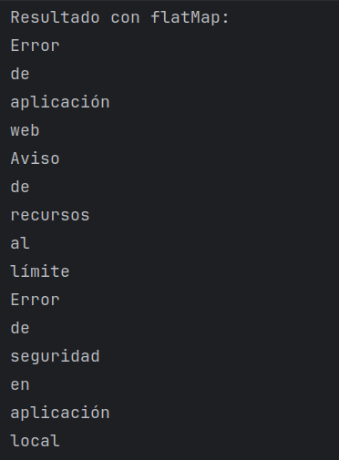

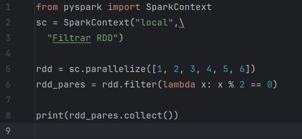

En este ejemplo:

-   Se crea un acumulador contador inicializado en 0.

-   En la transformación foreach, se incrementa el acumulador si el número es mayor que 5.

-   El valor final del acumulador se imprime en el driver.

**Sumar valores de un RDD**

```
from pyspark import SparkContext

sc = SparkContext("local", "Ejemplo Acumulador Suma")

rdd = sc.parallelize(\[1, 2, 3, 4, 5\])

# Crear un acumulador para la suma
suma_acumulador = sc.accumulator(0)

# Transformación: Sumar todos los valores al acumulador
rdd.foreach(lambda x: suma_acumulador.add(x))

# Acción: Mostrar el valor del acumulador
print("Suma total:", suma_acumulador.value) # Salida: 15

# Cerrar SparkContext
sc.stop()
```

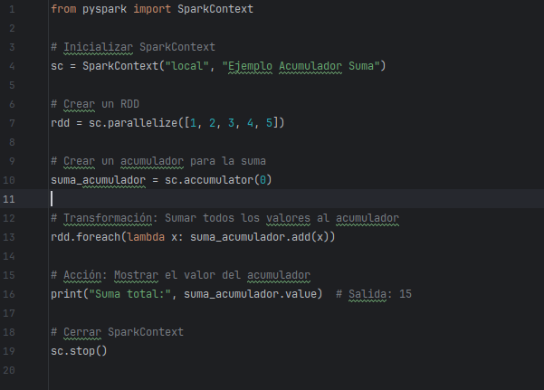


En este ejemplo:

-   Se crea un acumulador suma\_acumulador inicializado en 0.

-   En la transformación foreach, se suma cada valor del RDD al acumulador.

-   El valor final del acumulador se imprime en el driver.

**Contabilizar inconsistencias de un RDD**

```
from pyspark.sql import SparkSession

spark = SparkSession.builder.appName("Acumuladores").getOrCreate()

sc = spark.sparkContext

rdd_usuarios = sc.parallelize([
    (1, "Ana", 25),
    (2, "Carlos", -1), # Edad inválida
    (3, "Luis", 30),
    (4, None, 40), # Nombre nulo
    (5, "Sofía", 0), # Edad inválida
])

# Crear un acumulador
acumulador_errores = sc.accumulator(0)

# Filtrar los registros inválidos mientras se incrementa el acumulador
rdd_usuarios_validos = rdd_usuarios.filter(lambda x: not (acumulador_errores.add(1) if x[1] is None or x[2] &lt;= 0 else False))

# Ejecutar la transformación y mostrar resultados
print("Usuarios válidos:", rdd_usuarios_validos.collect())
print("Total de registros inválidos:", acumulador_errores.value)
```


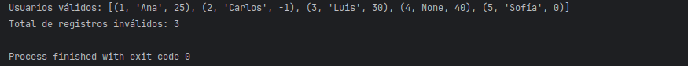

En este ejemplo:

-   Se usa **acumulador\_errores.add(1)** dentro de filter().

-   Cuando un usuario tiene datos inválidos (None o edad ≤ 0), el acumulador se incrementa antes de excluir el registro.

## Tarea 9: Creando DataFrames

Los DataFrames en PySpark son una estructura de datos distribuida y optimizada que permite trabajar con datos estructurados o semiestructurados de manera mucho más eficiente que los RDD.

Los DataFrames se pueden crear a partir de varias fuentes de datos, como archivos (CSV, JSON, Parquet), bases de datos, o RDDs.

**Crear un DataFrame desde una lista de datos**

```
from pyspark.sql import SparkSession
spark = SparkSession\
    .builder.appName("Crear DataFrame de lista")\
    .getOrCreate()

# Crear un DataFrame desde una lista de datos
data = [("Enero", 34667), ("Febrero", 48795), ("Marzo", 87548)]
df = spark.createDataFrame(data, ["Mes", "Ingreso"])

# Mostrar el DataFrame
df.show()
```


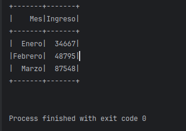

**En este ejemplo:**

-   spark.createDataFrame() crea un DataFrame a partir de una lista de tuplas.

-   El segundo argumento especifica los nombres de las columnas.

**DataFrame creado a partir de un diccionario**

```
from pyspark.sql import SparkSession

# Crear una SparkSession
spark = SparkSession.builder.appName("EjemploEsquema").getOrCreate()

# Crear datos como una lista de diccionarios
data = [
{"Nombre": "Alfonso", "Edad": 25, "Ciudad": "Abejorral"},
{"Nombre": "Bernado", "Edad": 30, "Ciudad": "Bogota"},
{"Nombre": "Celeste", "Edad": 35, "Ciudad": "Cartagena"}
]

# Crear el DataFrame
df = spark.createDataFrame(data)

# Mostrar la información
df.show()

# Consultar el esquema del DataFrame
df.printSchema()
```

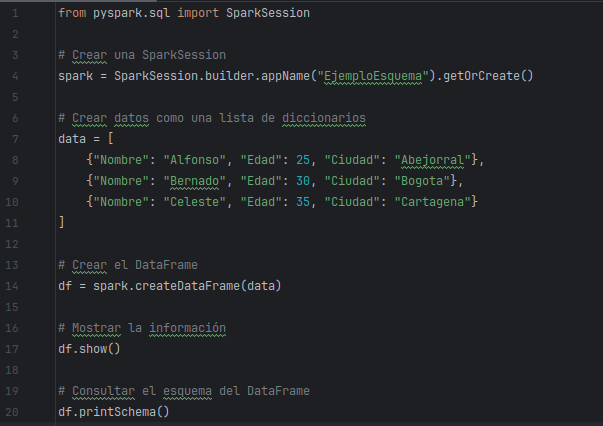

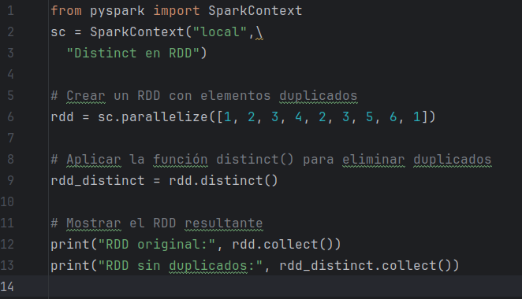

**En este ejemplo:**

-   **createDataFrame** se utiliza para crear el DataFrame desde una colección.

-   **df.printSchema** muestra la estructura de datos inferida

**Crear un DataFrame desde un archivo CSV**

```
from pyspark.sql import SparkSession
spark = SparkSession\
.builder\
.appName("Ejemplo CSV")\
.getOrCreate()

# Crear un DataFrame desde un archivo CSV
df = spark.read.csv("/home/miguel/data/Sales.csv")

# Mostrar el DataFrame y el esquema
df.show(5)
df.printSchema()
```

**En este ejemplo:**

-   **spark.read.csv()** carga un archivo CSV.
-   Nótese el primer registro, nombres de columnas y tipos de datos.

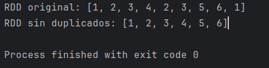

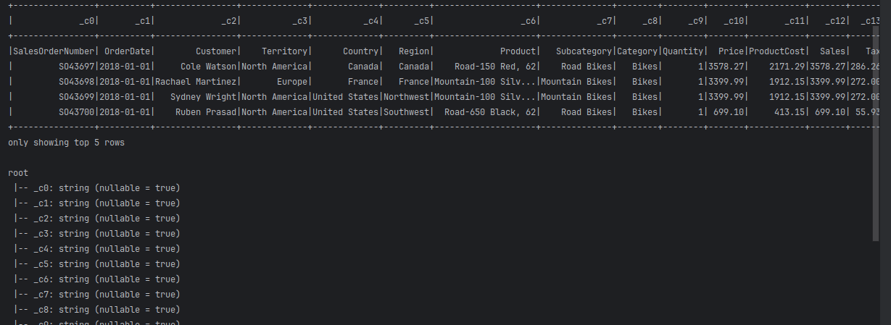

**Crear un DataFrame desde un archivo CSV infiriendo esquema e identificando encabezados**

```
from pyspark.sql import SparkSession
spark = SparkSession\
.builder\
.appName("Ejemplo CSV")\
.getOrCreate()

# Crear un DataFrame desde un archivo CSV
df = spark.read.csv("/home/miguel/data/Sales.csv",header=True, inferSchema=True)

# Mostrar el DataFrame y el esquema
df.show(5)
df.printSchema()
```

**En este ejemplo:**

-   **spark.read.csv()** carga un archivo CSV.

-   **header=True** indica que la primera fila contiene los nombres de las columnas.

-   **inferSchema=True** infiere automáticamente los tipos de datos de las columnas.

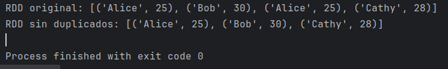

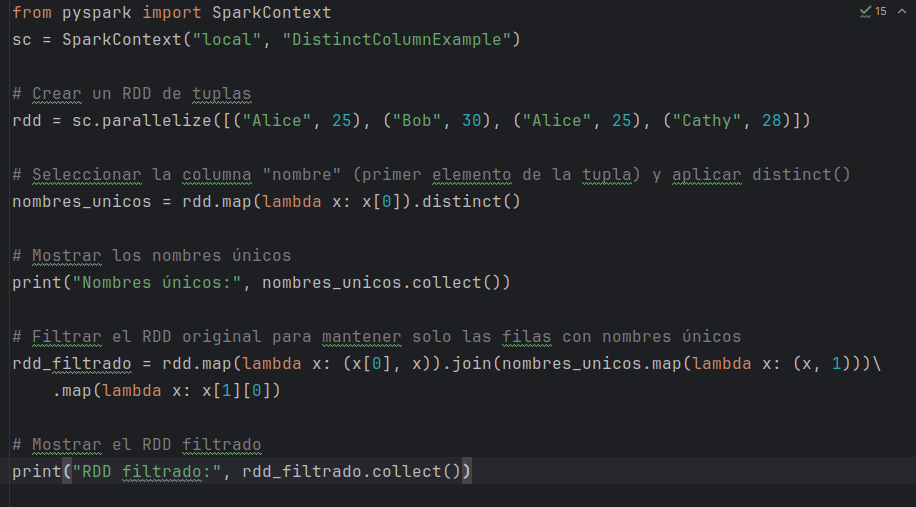

**Crear un DataFrame desde un archivo parquet**

```
from pyspark.sql import SparkSession
spark = SparkSession\
.builder\
.appName("Ejemplo CSV")\
.getOrCreate()

# Crear un DataFrame desde un archivo CSV
df = spark.read.parquet("/home/miguel/data/house-price.parquet")

# Mostrar el DataFrame y el esquema
df.show(10)
df.printSchema()
```

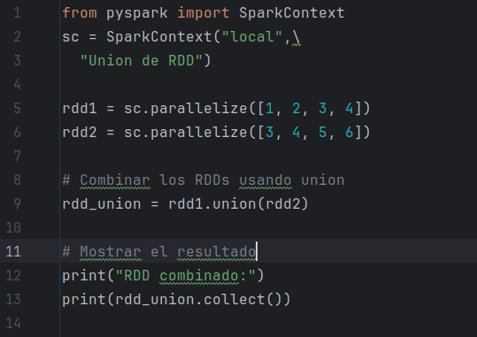

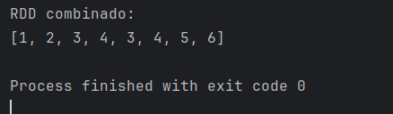

**DataFrame desde un archivo JSON**

```
from pyspark.sql import SparkSession

# Crear una SparkSession
spark = SparkSession\
    .builder\
    .appName("Ejemplo dataframe con JSON")\
    .getOrCreate()

# Cargar el DataFrame desde un archivo JSON
df = spark.read.json("/home/miguel/data/users.json", multiLine=True)

# Consultar el esquema del DataFrame
df.printSchema()

# Mostrar los primeros 10 registros del DataFrame
df.show(10)
```


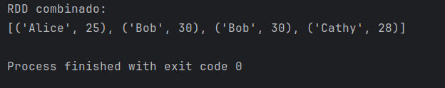

## 

## Tarea 10: Trabajando con DataFrames

Los DataFrames permiten realizar operaciones similares a las de SQL, como seleccionar columnas, filtrar filas, agrupar datos, etc.

**Seleccionar columnas desde colección**

```
from pyspark.sql import SparkSession
from pyspark.sql.functions import col

spark = SparkSession\
.builder\
.appName("Selecion de columnas DataFrame")\
.getOrCreate()

# Datos de ejemplo
data = [
  (1, "Alicia", 48, 10000),
  (2, "Bernardo", 27, 20000),
  (3, "Cesar", 32, 300000)
]

columns = ["id", "nombre", "edad", "salario"]

# Crear DataFrame
df = spark.createDataFrame(data, columns)

# Mostrar el DataFrame
df.show()
```

**En este ejemplo:**

-   **pyspark.sql.functions import col** habilita el acceso al objeto columna (col) en un DataSet

-   **columns = \["id", "nombre", "edad", "salario"\]** declara las columnas que tendrá el DataFrame

-   **createDataFrame(data, columns)** crea el DataFrame a partir de la colección de datos y la declaración de columnas


**Seleccionar columnas con select()**

```
from pyspark.sql import SparkSession
from pyspark.sql.functions import col

spark = SparkSession\
.builder\
.appName("Selecion de columnas DataFrame")\
.getOrCreate()

# Crear DataFrame
df = spark.read.csv("/home/miguel/data/Model/Products.csv", inferSchema=True, header=True)

df.printSchema()
# Mostrar el DataFrame
df.select("Product","Cost","Price").show(10)
```

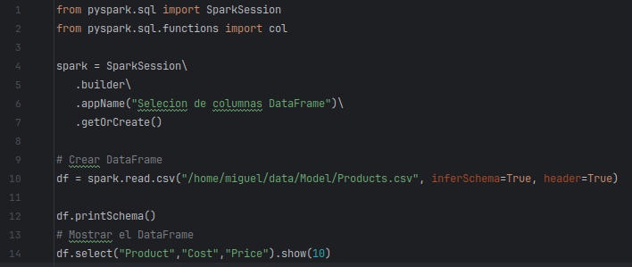

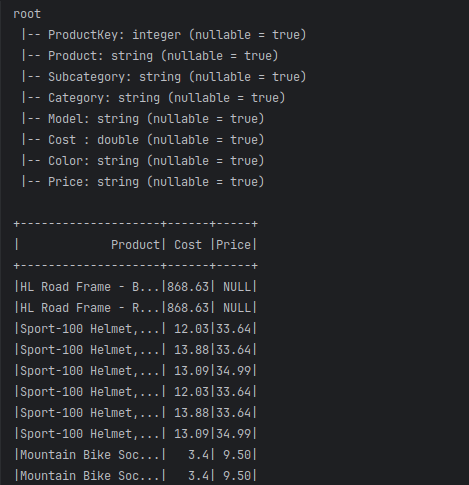

**Seleccionar columnas con la función col()**

```
from pyspark.sql import SparkSession
from pyspark.sql.functions import col

spark = SparkSession\
    .builder\
    .appName("Selecion de columnas DataFrame")\
    .getOrCreate()

# Crear DataFrame
df = spark.read.csv("/home/miguel/data/Model/Products.csv", inferSchema=True, header=True)

df.printSchema()

# Mostrar el DataFrame
df.select(col("Product"),col("Cost"),col("Price")).show(10)
```

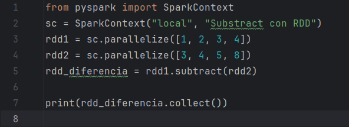


**Renombrar columnas**

Con el objeto **col(),** es posible cambiar el nombre de las columnas recuperadas con su atributo **alias()**

```
from pyspark.sql import SparkSession
from pyspark.sql.functions import col

spark = SparkSession\
    .builder\
    .appName("Selecion de columnas DataFrame")\
    .getOrCreate()

# Crear DataFrame
df = spark.read.csv("/home/miguel/data/Sales.csv", inferSchema=True, header=True)

# Mostrar el DataFrame
df.select(col("SalesOrderNumber").alias("Order"),col("Product").alias("Producto")
          ,col("Quantity").alias("Cantidad"),col("Sales").alias("Importe")).show(10)**
```

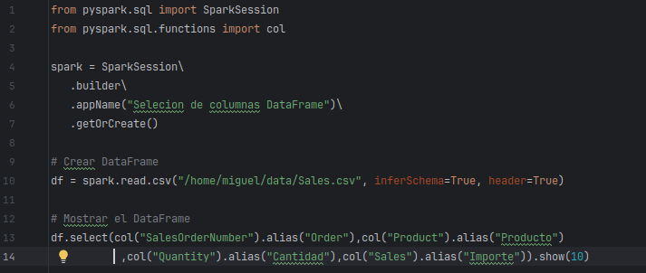

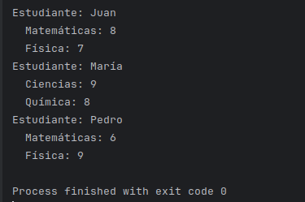

**Agregar columnas literales a un DataFrame existente**

Para adicionar una columna con valor fijo, la función **lit()** permite asignar un valor constante a una nueva columna.

```
from pyspark.sql import SparkSession
from pyspark.sql.functions import col, lit

spark = SparkSession\
    .builder\
    .appName("Calculo de columnas DataFrame")\
    .getOrCreate()

# Crear DataFrame
df = spark.read.json("/home/miguel/data/users.json", multiLine=True)

# MAdicinar la coluna Status con un valor fijo
df_empleados = df.withColumn("Status",lit("Active"))

#Mostrar el DataFrame
df_empleados.show()
```

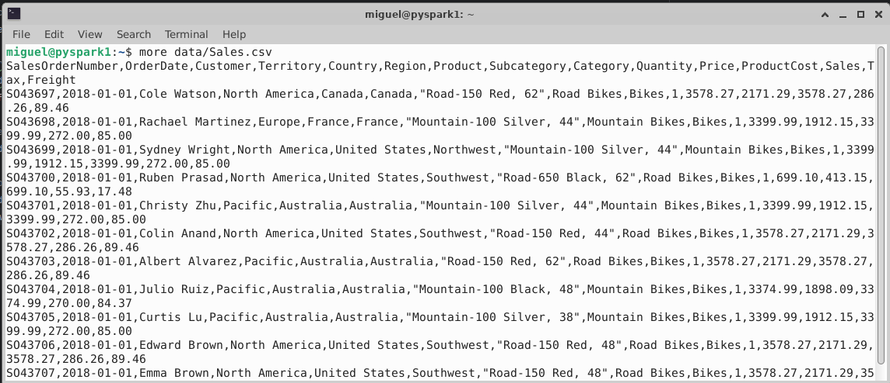

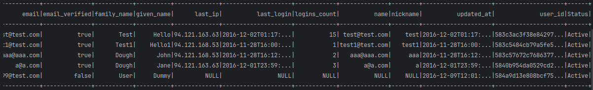

La función lit no se limita a valores simples como enteros o cadenas.

Se pueden manejar expresiones más complejas, como cálculos matemáticos o concatenación de múltiples columnas.

**Agregar colunas calculadas**

Una forma de adicionar columnas calculadas es a través de la función expr(). El cálculo se puede basar en el nombre de la columna original o en el alias.

from pyspark.sql import SparkSession
from pyspark.sql.functions import col
from pyspark.sql.functions import expr

spark = SparkSession\
    .builder\
    .appName("Selecion de columnas DataFrame")\
    .getOrCreate()

# Crear DataFrame
df = spark.read.csv("/home/miguel/data/Sales.csv", inferSchema=True, header=True)

# Mostrar el DataFrame
df.select(col("SalesOrderNumber").alias("Order"),col("Product").alias("Producto")
            ,col("Quantity").alias("Cantidad"),col("Sales").alias("Importe"),

expr("Sales \* Quantity").alias("Subtotal")).show(10)

**En este ejemplo:**

-   **from pyspark.sql.functions import expr** importa la función exp(), que permite definir una expresión como valor de la columna

-   **expr("Sales \* Quantity").alias("Subtotal")** crea la nueva columna.

**Agregar columnas calculadas a un DataFrame existente**

La función **withColumn()** devuelve un nuevo DataFrame agregando una columna o reemplazando la columna existente que tiene el mismo nombre

```
from pyspark.sql import SparkSession
from pyspark.sql.functions import col
from pyspark.sql.functions import expr

spark = SparkSession\
    .builder\
    .appName("Selecion de columnas DataFrame")\
    .getOrCreate()

# Crear DataFrame
df = spark.read.csv("/home/miguel/data/Sales.csv", inferSchema=True, header=True)

# Mostrar el DataFrame
df_productos = df.select(col("SalesOrderNumber").alias("Order"),col("Product").alias("Producto")
          ,col("Quantity").alias("Cantidad"),col("Sales").alias("Importe"))

df_productos = df_productos.withColumn("Total", df_productos.Cantidad * df_productos.Importe)

df_productos.show(3)
```

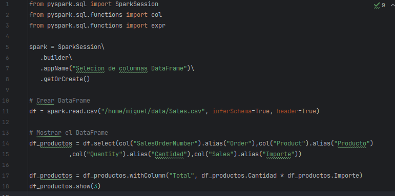


Adicionar varias columnas a un DataFrame existente.

La función **withColumns()** permite adicionar varias columnas a un DataFrame existente

```
from pyspark.sql import SparkSession
from pyspark.sql.functions import col
from pyspark.sql.functions import expr

spark = SparkSession\
.builder\
.appName("Calculo de columnas DataFrame")\
.getOrCreate()

# Crear DataFrame
df = spark.read.csv("/home/miguel/data/Sales.csv", inferSchema=True, header=True)

# Mostrar el DataFrame
df_productos = df.select(col("SalesOrderNumber").alias("Order"),col("Product").alias("Producto")
,col("Quantity").alias("Cantidad"),col("Sales").alias("Importe"))

df_productos = df_productos.withColumns({"Total": df_productos.Cantidad * df_productos.Importe,
"Impuesto": df_productos.Importe*.16})
df_productos.show(3)
```

**En este ejemplo:**

-   Nótese que, para indicar que se va a adicionar una colección de columnas, estas aparecen con **{}** en la función **withColumns()**


**Salvar DataFrames en archivos**

Se pueden salvar DataFrames en diferentes formatos de archivo: CSV, Parquet y JSON. Cada uno de estos formatos tiene sus ventajas y usos específicos.

**Salvar en archivo csv**

```
from pyspark.sql import SparkSession
from pyspark.sql.functions import col
from pyspark.sql.functions import expr

spark = SparkSession\
    .builder\
    .appName("Salvar DataFrame csv")\
    .getOrCreate()

# Crear DataFrame
df = spark.read.csv("/home/miguel/data/Sales.csv", inferSchema=True, header=True)

# Mostrar el DataFrame
df_productos = df.select(col("SalesOrderNumber").alias("Order"),col("Product").alias("Producto")
          ,col("Quantity").alias("Cantidad"),col("Sales").alias("Importe"))

df_productos = df_productos.withColumns({"Total": df_productos.Cantidad * df_productos.Importe,
"Impuesto": df_productos.Importe*.16})
df_productos.show(3)

# Guardar el DataFrame en un archivo CSV

df_productos.write.csv("/home/miguel/data/salida/reporte1.csv", header=True, mode="overwrite")
```

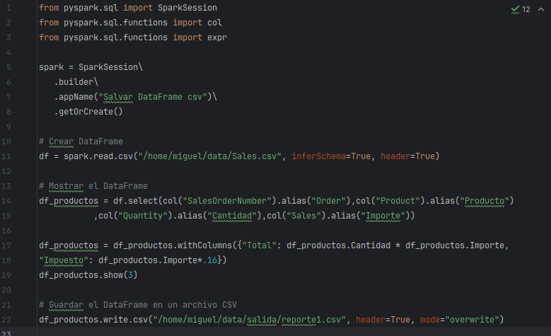


El parámetro **mode** controla el comportamiento si el archivo ya existe. Los valores comunes son **overwrite** (sobrescribir el archivo existente), **append** (agregar al archivo existente), **ignore** (no guardar si el archivo ya existe) y **error** (lanzar un error si el archivo ya existe).

**Salvar el archivo como parquet**

```
from pyspark.sql import SparkSession
from pyspark.sql.functions import col
from pyspark.sql.functions import expr

spark = SparkSession\
    .builder\
    .appName("Salvar DataFrame csv")\
    .getOrCreate()

# Crear DataFrame
df = spark.read.csv("/home/miguel/data/Sales.csv", inferSchema=True, header=True)

# Mostrar el DataFrame
df_productos = df.select(col("SalesOrderNumber").alias("Order"),col("Product").alias("Producto")
              ,col("Quantity").alias("Cantidad"),col("Sales").alias("Importe"))

df_productos = df_productos.withColumns({"Total": df_productos.Cantidad * df_productos.Importe,
"Impuesto": df_productos.Importe*.16})
df_productos.show(3)

# Guardar el DataFrame en un archivo Parquet
df_productos.write.parquet("/home/miguel/data/salida/reporte2.parquet", mode=”overwrite”)
```


Al mostrar el contenido del directorio, se muestran archivos por partición. Este es el comportamiento por omisión.


¿Cómo reducir a un solo archivo y cambiar la salida del archivo salvado?

Hay que reducir las particiones antes de salvar el archivo. Esto se logra con la función coalesce():

```
from pyspark.sql import SparkSession
from pyspark.sql.functions import col
from pyspark.sql.functions import expr
import os

spark = SparkSession\
    .builder\
    .appName("Salvar DataFrame csv")\
    .getOrCreate()

# Crear DataFrame
df = spark.read.csv("/home/miguel/data/Sales.csv", inferSchema=True, header=True)

# Mostrar el DataFrame
df_productos = df.select(col("SalesOrderNumber").alias("Order"),col("Product").alias("Producto")
              ,col("Quantity").alias("Cantidad"),col("Sales").alias("Importe"))

df_productos = df_productos.withColumns({"Total": df_productos.Cantidad * df_productos.Importe,
"Impuesto": df_productos.Importe*.16})

df_productos.show(3)

dfx = df_productos.withColumnRenamed("Impuesto","Tax")

dfx.printSchema()
dfx.show(10)
```

<span class="mark">df\_productos =df\_productos.coalesce(1)</span>

```
# Guardar el DataFrame en un archivo CSV
df_productos.write.csv("/home/netec/data/salida", header=True, mode="overwrite")

# Renombrar el archivo
archivos = os.listdir("/home/miguel/data/salida/")
archivo_csv = [f for f in archivos if f.endswith(".csv")][0]

os.rename(f"/home/netec/data/salida/{archivo\_csv}", "/home/netec/data/salida/reporte.csv")
```

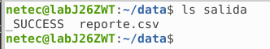

***Fin del laboratorio***
