# Laboratorio 8: Uso de agregaciones, agrupaciones y relaciones

**Objetivo:** Aplicar agregaciones, agrupaciones y relaciones

**Tiempo estimado:** 60 minutos

**Prerequisitos:**

-   Acceso a ambiente Linux (credenciales provistas en el curso) o Linux
    local con interfaz gráfica

-   Tener los archivos de datos

-   Completar el laboratorio 1

**Contexto:**

Como parte de las consultas y análisis, el vincular tablas de diferentes
fuentes es una necesidad regular, así como obtener agregaciones para
analizar la información.

En PySpark, se puede realizar agregaciones y agrupaciones utilizando
tanto DataFrames como SQL.

Funciones de Agregación Comunes en SQL

Las funciones de agregación más comunes en SQL son:

-   **COUNT**: Cuenta el número de filas.

-   **SUM**: Suma los valores de una columna.

-   **AVG**: Calcula el promedio de los valores de una columna.

-   **MIN**: Encuentra el valor mínimo de una columna.

-   **MAX**: Encuentra el valor máximo de una columna.

**Instrucciones:**

Tarea1: Agregaciones y agrupaciones con SQL

**Agrupar DataFrames**

Abrimos la sesión de PyCharm e introducimos el siguente código:

**from pyspark.sql import SparkSession**

spark = SparkSession\\

.builder\\

.appName("Usra SQL y DataFrames")\\

.getOrCreate()

**\# Crear DataFrame**

**dfSales = spark.read.csv("/home/miguel/data/Sales.csv",
inferSchema=True, header=True)**

**\# Registrar el DataFrame como una tabla temporal**

**dfSales.createOrReplaceTempView("ventas")**

**query = ("SELECT Country, SUM(Sales) AS TotalSales "**

**" FROM ventas "**

**" GROUP BY Country "**

**)**

**spark.sql(query).show()**

**En este ejemplo:**

-   **createOrReplaceTempView** expone el DataFrame como table para
    usarse en la sentencia SQL

-   **SUM()** suma los valores del campo Sales y los corta por Country

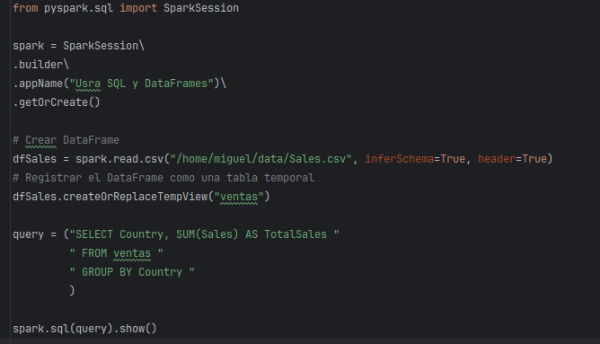{width="3.625495406824147in"
height="2.0785673665791777in"}

{width="1.927331583552056in"
height="1.8251760717410324in"}

**Agrupar por más de un campo**

Se pueden aplicar cortes en más de un campo. Es importante considerar
que si los campos no utilizan una función de agregación, todos ellos
deberán estar en GROUP BY. El primer campo declarado maneja la
agrupación principal.

from pyspark.sql import SparkSession

spark = SparkSession\\

.builder\\

.appName("Usra SQL y DataFrames")\\

.getOrCreate()

\# Crear DataFrame

dfSales = spark.read.csv("/home/miguel/data/Sales.csv",
inferSchema=True, header=True)

\# Registrar el DataFrame como una tabla temporal

dfSales.createOrReplaceTempView("ventas")

query = ("SELECT Territory, Country, SUM(Sales) AS TotalSales "

" FROM ventas "

" GROUP BY Territory, Country "

)

spark.sql(query).show()

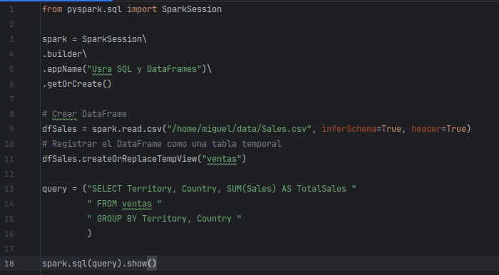{width="4.372521872265967in"
height="2.410873797025372in"}

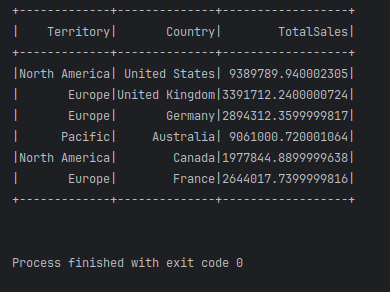{width="2.5345538057742782in"
height="1.8976662292213473in"}

**Aplicar múltiples funciones de agregación**

from pyspark.sql import SparkSession

spark = SparkSession\\

.builder\\

.appName("Usra SQL y DataFrames")\\

.getOrCreate()

\# Crear DataFrame

dfSales = spark.read.csv("/home/miguel/data/Model/Products.csv",
inferSchema=True, header=True)

\# Registrar el DataFrame como una tabla temporal

dfSales.createOrReplaceTempView("productos")

query = ("SELECT Category, SUM(Price) As TotalSales, AVG(Price) as
Average, MIN(Price) as MinPrice"

" FROM productos "

" GROUP BY Category "

)

dfVentas= spark.sql(query)

dfVentas.show()

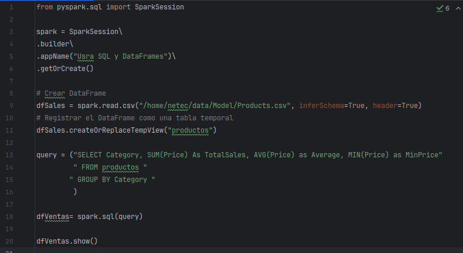{width="4.168404418197725in"
height="2.2738035870516184in"}

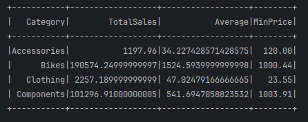{width="3.6583311461067365in"
height="1.4518482064741907in"}

**Usando HAVING**

Notemos la ejecución del siguiente código

from pyspark.sql import SparkSession

spark = SparkSession\\

.builder\\

.appName("Usra SQL y DataFrames")\\

.getOrCreate()

\# Crear DataFrame

dfProducts = spark.read.csv("/home/miguel/data/Model/Products.csv",
inferSchema=True, header=True)

\# Registrar el DataFrame como una tabla temporal

dfProducts.createOrReplaceTempView("productos")

\# Consultar la cantidad de productos por categoría

query = ("SELECT Category, COUNT(Product) as NoProducts"

" FROM productos "

" GROUP BY Category "

\# "HAVING COUNT(Product) \>5"

)

dfProducts= spark.sql(query)

dfProducts.show()

{width="4.396468722659668in"
height="2.540977690288714in"}

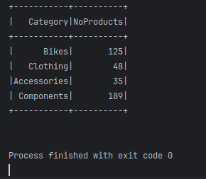{width="2.0673643919510063in"
height="1.8035968941382328in"}

¿Cómo obtener las categorías cuyo total es superior a 100?

La cláusula WHERE no puede ser aplicable porque esta se aplica a nivel
registro y no a nivel agrupación. Para aplicar condiciones por grupo se
tiene a la cláusula HAVING

from pyspark.sql import SparkSession

spark = SparkSession\\

.builder\\

.appName("Usra SQL y DataFrames")\\

.getOrCreate()

\# Crear DataFrame

dfProducts = spark.read.csv("/home/netec/data/Model/Products.csv",
inferSchema=True, header=True)

\# Registrar el DataFrame como una tabla temporal

dfProducts.createOrReplaceTempView("productos")

\# Consultar la cantidad de productos por categoría

query = ("SELECT Category, COUNT(Product) as NoProducts"

" FROM productos "

" GROUP BY Category "

"HAVING COUNT(Product) \>100"

)

dfProducts= spark.sql(query)

dfProducts.show()

La cláusula HAVING se puede aplicar a cualquier agregación. También se
puede combinar con WHERE, ya que esta filtra registros y HAVING
agregaciones.

{width="4.2686220472440946in"
height="2.6057042869641296in"}

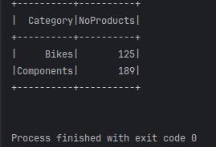{width="2.1699343832021in"
height="1.4842672790901137in"}

**Agregación sin agrupación**

Si no se usa GROUP BY, las funciones de agregación se aplican a toda la
tabla.

from pyspark.sql import SparkSession

spark = SparkSession\\

.builder\\

.appName("Usra SQL y DataFrames")\\

.getOrCreate()

\# Crear DataFrame

dfProducts = spark.read.csv("/home/miguel/data/Model/Products.csv",
inferSchema=True, header=True)

\# Registrar el DataFrame como una tabla temporal

dfProducts.createOrReplaceTempView("productos")

\# Consultar la cantidad de productos por categoría

query = ("SELECT SUM(Price) As TotalSales, AVG(Price) as Average,
MAX(Price) as MaxPrice,"

" MIN(Price) as MinPrice, COUNT(price) as NoProducts"

" FROM productos "

)

dfProducts= spark.sql(query)

dfProducts.show()

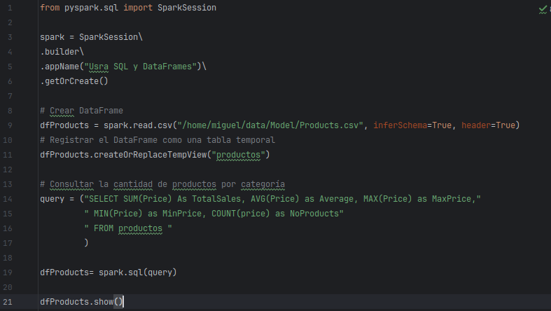{width="4.290988626421697in"
height="2.4207819335083114in"}

{width="4.345452755905511in"
height="0.9479472878390202in"}

## 

## Tarea 2: Manejando relaciones

Se puede utilizar SQL para trabajar con relaciones entre tablas
(DataFrames) utilizando operaciones como JOIN, UNION, INTERSECT, y
EXCEPT. Estas operaciones permiten combinar o comparar datos de
múltiples tablas basadas en condiciones específicas.

JOIN se utiliza para combinar filas de dos o más tablas basadas en una
condición relacionada. Los tipos más comunes de JOIN son:

-   **INNER JOIN:** Devuelve solo las filas que tienen coincidencias en
    ambas tablas.

-   **LEFT JOIN (o LEFT OUTER JOIN):** Devuelve todas las filas de la
    tabla izquierda y las coincidencias de la tabla derecha. Si no hay
    coincidencias, se devuelven NULL para las columnas de la tabla
    derecha.

-   **RIGHT JOIN (o RIGHT OUTER JOIN):** Devuelve todas las filas de la
    tabla derecha y las coincidencias de la tabla izquierda. Si no hay
    coincidencias, se devuelven NULL para las columnas de la tabla
    izquierda.

-   **FULL JOIN (o FULL OUTER JOIN):** Devuelve todas las filas cuando
    hay una coincidencia en cualquiera de las tablas. Si no hay
    coincidencias, se devuelven NULL para las columnas de la tabla sin
    coincidencias.

from pyspark.sql import SparkSession

spark = SparkSession\\

.builder\\

.appName("Usra SQL y DataFrames")\\

.getOrCreate()

\# Crear DataFrame de productos

dfProducts = spark.read.csv("/home/miguel /data/Model/Products.csv",
inferSchema=True, header=True)

\# Registrar el DataFrame como una tabla temporal

dfProducts.createOrReplaceTempView("productos")

\# Crear DataFrame de clientes

dfProducts = spark.read.csv("/home/miguel /data/Model/Customers.csv",
inferSchema=True, header=True)

\# Registrar el DataFrame como una tabla temporal

dfProducts.createOrReplaceTempView("clientes")

\# Crear DataFrame de clientes

dfProducts = spark.read.csv("/home/miguel/data/Model/Sales.csv",
inferSchema=True, header=True)

\# Registrar el DataFrame como una tabla temporal

dfProducts.createOrReplaceTempView("ventas")

#Combina solo las filas que tienen coincidencias en lass tres tablas.

query = ("SELECT v.SalesOrderNumber,c.Customer, v.OrderDate,p.Product,
p.Category,"

" v.UnitPrice,v.OrderQuantity "

" FROM ventas v JOIN productos p on v.productkey = p.productkey"

" JOIN clientes c on v.customerKey = c.customerKey"

)

dfProducts= spark.sql(query)

dfProducts.show()

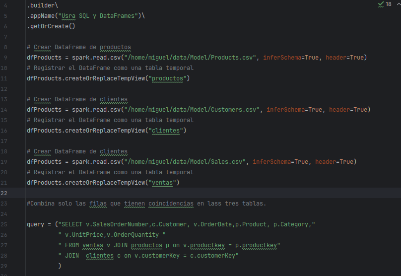{width="3.500285433070866in"
height="2.408772965879265in"}

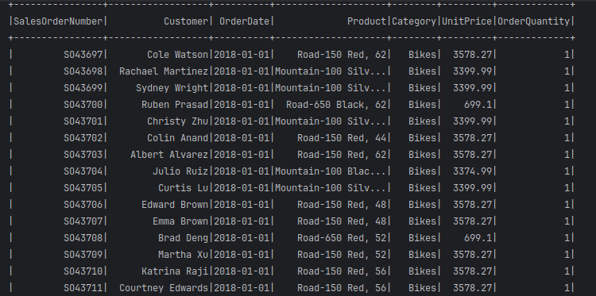{width="3.645625546806649in"
height="1.8129133858267716in"}

**Aplicando diferentes tipos de relación**

Nótese que de la lista, hay empleados sin departamento y departamentos
sin empleados (en base al campo común). En INNER JOIN no se mostrarán
estos registros

from pyspark.sql import SparkSession

spark = SparkSession.builder.appName("SQL relaciones").getOrCreate()

\# Datos de empleados

data_empleados = \[

(1, "Alejandra", 101),

(2, "Berenice", 102),

(3, "Carlos", 101),

(4, "Daniela", 104),

(5, "Ernesto", 110)

\]

\# Datos de departamentos

data_departamentos = \[

(101, "Ventas"),

(102, "Marketing"),

(103, "IT"),

(105, "RH"),

(106, "Operacione"),

\]

\# Crear DataFrames

df_empleados = spark.createDataFrame(data_empleados, \["id_empleado",
"nombre", "id_departamento"\])

df_departamentos = spark.createDataFrame(data_departamentos,
\["id_departamento", "nombre_departamento"\])

\# Registrar DataFrames como tablas temporales

df_empleados.createOrReplaceTempView("empleados")

df_departamentos.createOrReplaceTempView("departamentos")

query = ("SELECT e.id_empleado, e.nombre, d.nombre_departamento "

"FROM empleados e "

"INNER JOIN departamentos d "

"ON e.id_departamento = d.id_departamento")

spark.sql(query).show()

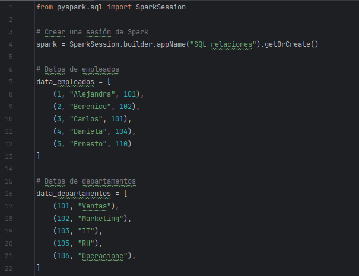{width="4.283389107611549in"
height="3.2990540244969377in"}

{width="3.031482939632546in"
height="1.777363298337708in"}

**LEFT JOIN**

Devuelve todos los empleados, incluso si no tienen un departamento
asignado.

from pyspark.sql import SparkSession

\# Crear una sesión de Spark

spark = SparkSession.builder.appName("SQL relaciones").getOrCreate()

\# Datos de empleados

data_empleados = \[

(1, "Alejandra", 101),

(2, "Berenice", 102),

(3, "Carlos", 101),

(4, "Daniela", 104),

(5, "Ernesto", 110)

\]

\# Datos de departamentos

data_departamentos = \[

(101, "Ventas"),

(102, "Marketing"),

(103, "IT"),

(105, "RH"),

(106, "Operacione"),

\]

\# Crear DataFrames

df_empleados = spark.createDataFrame(data_empleados, \["id_empleado",
"nombre", "id_departamento"\])

df_departamentos = spark.createDataFrame(data_departamentos,
\["id_departamento", "nombre_departamento"\])

\# Registrar DataFrames como tablas temporales

df_empleados.createOrReplaceTempView("empleados")

df_departamentos.createOrReplaceTempView("departamentos")

query = ("SELECT e.id_empleado, e.nombre, d.nombre_departamento "

"FROM empleados e "

"LEFT JOIN departamentos d "

"ON e.id_departamento = d.id_departamento")

spark.sql(query).show()

{width="4.526045494313211in"
height="0.7502635608048994in"}

{width="3.1044083552055994in"
height="2.0398075240594924in"}

**RIGHT JOIN**

Devuelve todos los departamentos, incluso si no tienen empleados
asignados.

from pyspark.sql import SparkSession

\# Crear una sesión de Spark

spark = SparkSession.builder.appName("SQL relaciones").getOrCreate()

\# Datos de empleados

data_empleados = \[

(1, "Alejandra", 101),

(2, "Berenice", 102),

(3, "Carlos", 101),

(4, "Daniela", 104),

(5, "Ernesto", 110)

\]

\# Datos de departamentos

data_departamentos = \[

(101, "Ventas"),

(102, "Marketing"),

(103, "IT"),

(105, "RH"),

(106, "Operacione"),

\]

\# Crear DataFrames

df_empleados = spark.createDataFrame(data_empleados, \["id_empleado",
"nombre", "id_departamento"\])

df_departamentos = spark.createDataFrame(data_departamentos,
\["id_departamento", "nombre_departamento"\])

\# Registrar DataFrames como tablas temporales

df_empleados.createOrReplaceTempView("empleados")

df_departamentos.createOrReplaceTempView("departamentos")

query = ("SELECT e.id_empleado, e.nombre, d.nombre_departamento "

"FROM empleados e "

"RIGHT JOIN departamentos d "

"ON e.id_departamento = d.id_departamento")

spark.sql(query).show()

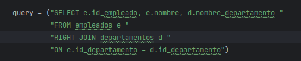{width="4.613600174978128in"
height="0.9482491251093613in"}

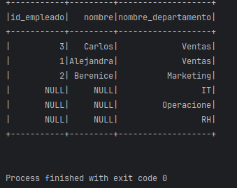{width="2.547687007874016in"
height="2.0291305774278214in"}

**FULL JOIN**

Devuelve todas las filas de ambas tablas, con NULL donde no hay
coincidencias.

from pyspark.sql import SparkSession

spark = SparkSession.builder.appName("SQL relaciones").getOrCreate()

\# Datos de empleados

data_empleados = \[

(1, "Alejandra", 101),

(2, "Berenice", 102),

(3, "Carlos", 101),

(4, "Daniela", 104),

(5, "Ernesto", 110)

\]

\# Datos de departamentos

data_departamentos = \[

(101, "Ventas"),

(102, "Marketing"),

(103, "IT"),

(105, "RH"),

(106, "Operacione"),

\]

\# Crear DataFrames

df_empleados = spark.createDataFrame(data_empleados, \["id_empleado",
"nombre", "id_departamento"\])

df_departamentos = spark.createDataFrame(data_departamentos,
\["id_departamento", "nombre_departamento"\])

\# Registrar DataFrames como tablas temporales

df_empleados.createOrReplaceTempView("empleados")

df_departamentos.createOrReplaceTempView("departamentos")

query = ("SELECT e.id_empleado, e.nombre, d.nombre_departamento "

"FROM empleados e "

"FULL JOIN departamentos d "

"ON e.id_departamento = d.id_departamento")

spark.sql(query).show()

{width="5.2472430008748905in"
height="0.8299682852143482in"}

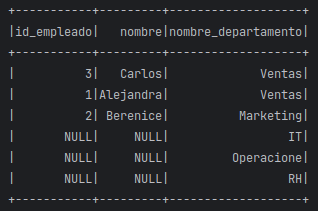{width="2.7250590551181104in"
height="1.8081375765529308in"}

**Relaciones con UNION**

El UNION combina los resultados de dos consultas en un solo conjunto de
resultados. Las filas duplicadas se eliminan a menos que se use UNION
ALL.

from pyspark.sql import SparkSession

spark = SparkSession\\

.builder\\

.appName("Usar UNION")\\

.getOrCreate()

\# Crear DataFrame de ventas del año 2018

df2018 = spark.read.csv("/home/miguel/data/TotalSales/Sales2018.csv",
inferSchema=True, header=True)

\# Registrar el DataFrame como una tabla temporal

df2018.createOrReplaceTempView("y2018")

\# Crear DataFrame de ventas del año 2018

df2019 = spark.read.csv("/home/miguel/data/TotalSales/Sales2019.csv",
inferSchema=True, header=True)

\# Registrar el DataFrame como una tabla temporal

df2019.createOrReplaceTempView("y2019")

\# Crear DataFrame de ventas del año 2018

df2020 = spark.read.csv("/home/miguel/data/TotalSales/Sales2020.csv",
inferSchema=True, header=True)

\# Registrar el DataFrame como una tabla temporal

df2020.createOrReplaceTempView("y2020")

\# Sumando los registros de las 3 tablas

query = ("SELECT \* FROM y2018 "

"UNION "

"SELECT \* FROM y2019 "

"UNION "

"SELECT \* FROM y2020 "

)

spark.sql(query).show()

{width="4.949208223972003in"
height="3.0054779090113737in"}

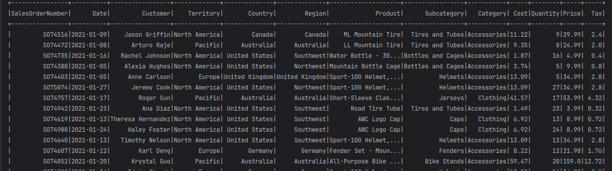{width="6.1375in" height="1.7229166666666667in"}

\*\*\* Fin del laboratorio
